# How to augment data using viewmastR

## Installing Rust

First you need to have an updated Rust installation. Go to this
[site](https://www.rust-lang.org/tools/install) to learn how to install
Rust.

## Installing viewmastR

You will need to have the devtools package installed…

``` r

devtools::install_github("furlan-lab/viewmastR")
```

## Load a dataset

``` r

suppressPackageStartupMessages({
library(viewmastR)
library(Seurat)
library(ggplot2)
library(scCustomize)
library(magrittr)
})


#query dataset
seu<-readRDS(file.path(ROOT_DIR1, "220302_final_object.RDS"))
```

## Let’s first fix this dataset and label with Tregs

Tregs are located in cluster 9 (as evidenced by FOXP3 expression), but
don’t have the correct label. Let’s fix that.

``` r

DimPlot_scCustom(seu, group.by = "celltype")
```

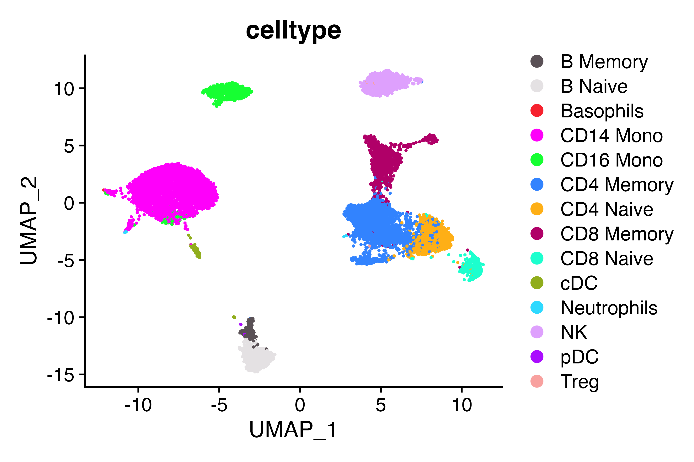

``` r

Idents(seu)<-seu$celltype
Cluster_Highlight_Plot(seu, cluster_name = "Treg")
```

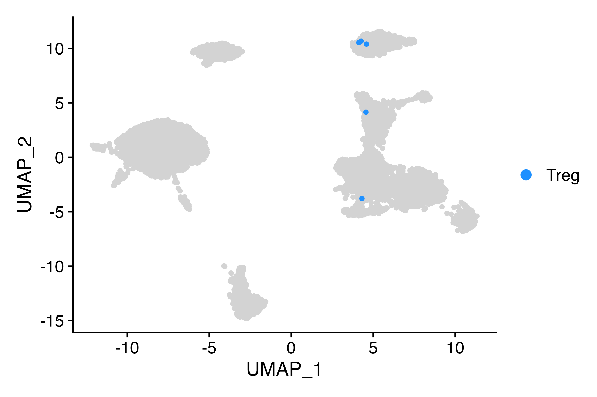

``` r

DimPlot_scCustom(seu, group.by = "seurat_clusters")
```

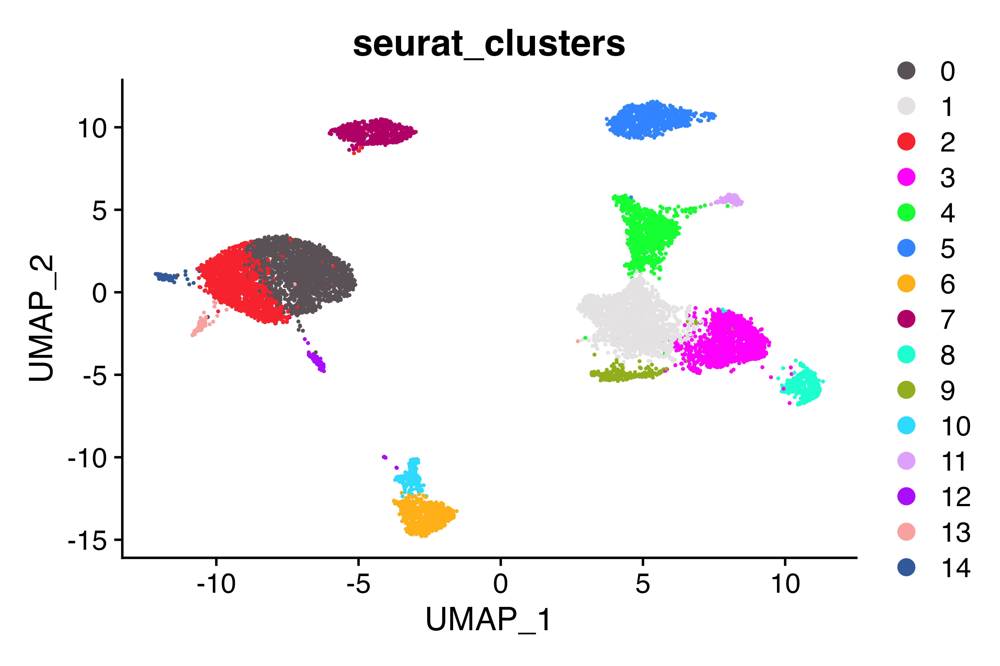

``` r

FeaturePlot_scCustom(seu, features = "FOXP3")
```

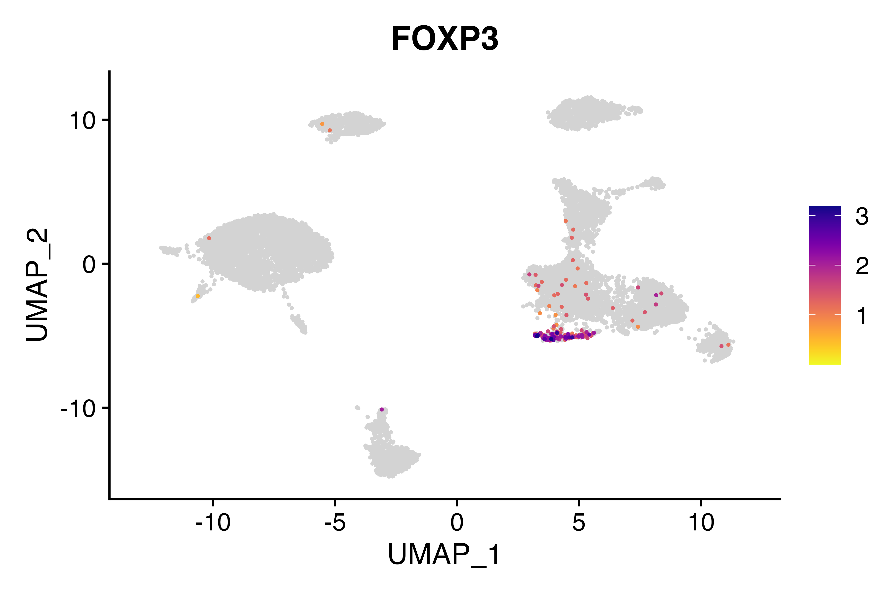

``` r

seu$celltype[seu$seurat_clusters %in% "9"]<-"Treg"
DimPlot_scCustom(seu, group.by = "celltype")
```


``` r

Idents(seu)<-seu$celltype
Cluster_Highlight_Plot(seu, cluster_name = "Treg")
```

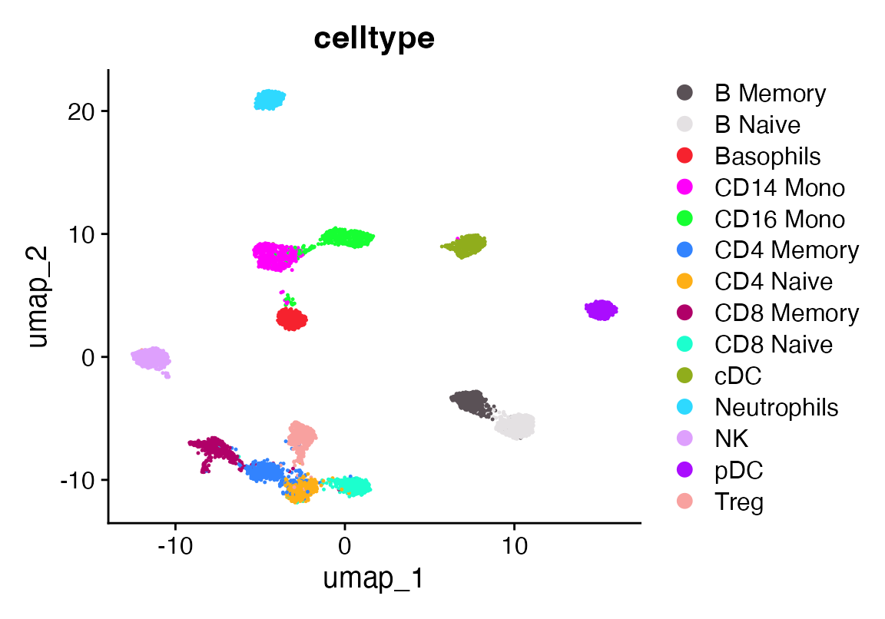

``` r

table(seu$celltype)
```

    ## 
    ##    B Memory     B Naive   Basophils   CD14 Mono   CD16 Mono  CD4 Memory 
    ##         199         666           9        3626         722        2115 
    ##   CD4 Naive  CD8 Memory   CD8 Naive         cDC Neutrophils          NK 
    ##        1142        1209         388         127           9         843 
    ##         pDC        Treg 
    ##           3         250

Better…

## Let’s augment rare celltypes for better learning but bringing any celltype to a minimum of 1500 cells. use the prune option to downsample any celltypes present above the norm_number down to that number.

``` r

seuA<-augment_data(seu, "celltype", norm_number = 500, prune = T)
seuA <- FindVariableFeatures(seuA, selection.method = "vst", nfeatures = 3000) %>% NormalizeData() %>% ScaleData()
seuA <- RunPCA(seuA, features = VariableFeatures(object = seuA), npcs = 50)
ElbowPlot(seuA, 50) 
```


``` r

seuA<- FindNeighbors(seuA, dims = 1:40) %>% FindClusters(resolution = 2) %>% RunUMAP(dims = 1:40, n.components = 2)
```

    ## Modularity Optimizer version 1.3.0 by Ludo Waltman and Nees Jan van Eck
    ## 
    ## Number of nodes: 7000
    ## Number of edges: 368306
    ## 
    ## Running Louvain algorithm...
    ## Maximum modularity in 10 random starts: 0.8507
    ## Number of communities: 16
    ## Elapsed time: 0 seconds

``` r

DimPlot_scCustom(seuA, group.by = "celltype")
```

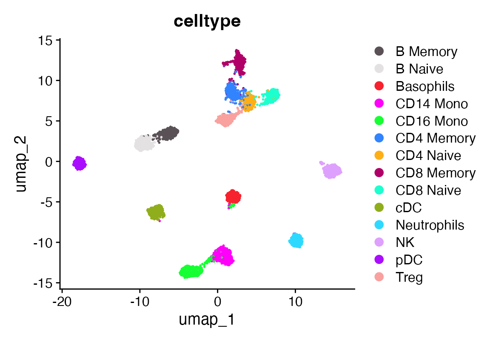

``` r

FeaturePlot_scCustom(seuA, features = "FOXP3")
```

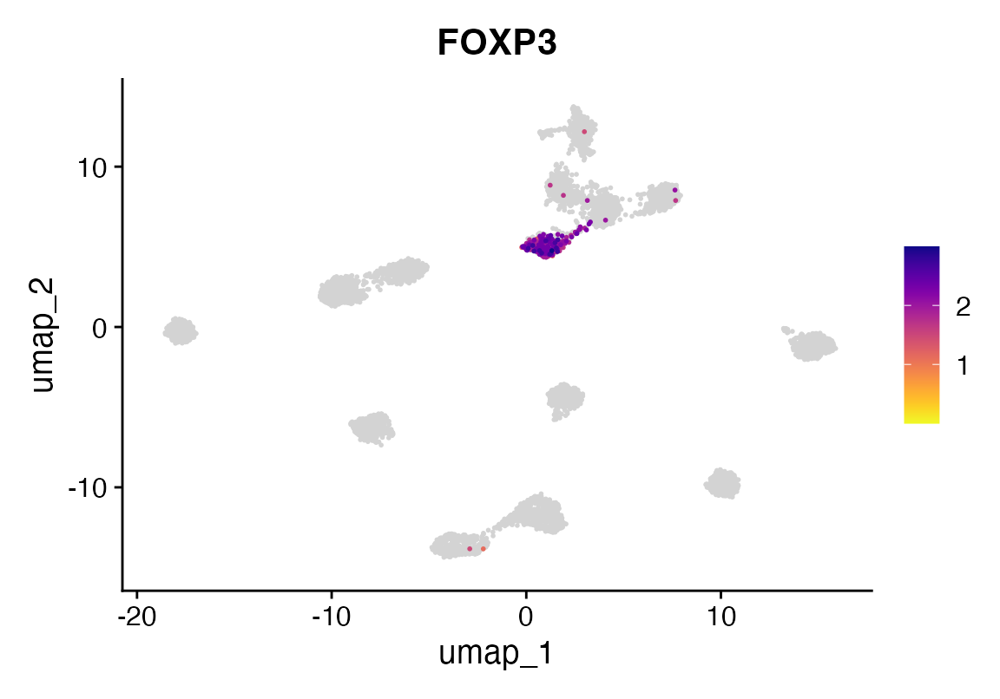

## Now we train another PBMC dataset with labels for tregs that are questionable and see if we can find them

``` r

seu<-readRDS(file.path(ROOT_DIR3, "240919_5p_seu.RDS"))

seu<-calculate_feature_dispersion(seu)
```

    ##   |                                                                              |                                                                      |   0%  |                                                                              |===================================                                   |  50%  |                                                                              |======================================================================| 100%

``` r

seu<-select_features(seu, top_n = 10000, logmean_ul = -1, logmean_ll = -8)
vgq<-get_selected_features(seu)

seuA<-calculate_feature_dispersion(seuA)
```

    ##   |                                                                              |                                                                      |   0%  |                                                                              |======================================================================| 100%

``` r

seuA<-select_features(seuA, top_n = 10000, logmean_ul = -1, logmean_ll = -8)
vgr<-get_selected_features(seuA)

vg<-intersect(vgq, vgr)

seu<-viewmastR(seu, seuA, ref_celldata_col = "celltype", selected_features = vg)

DimPlot_scCustom(seu, group.by = "mCelltype")
```

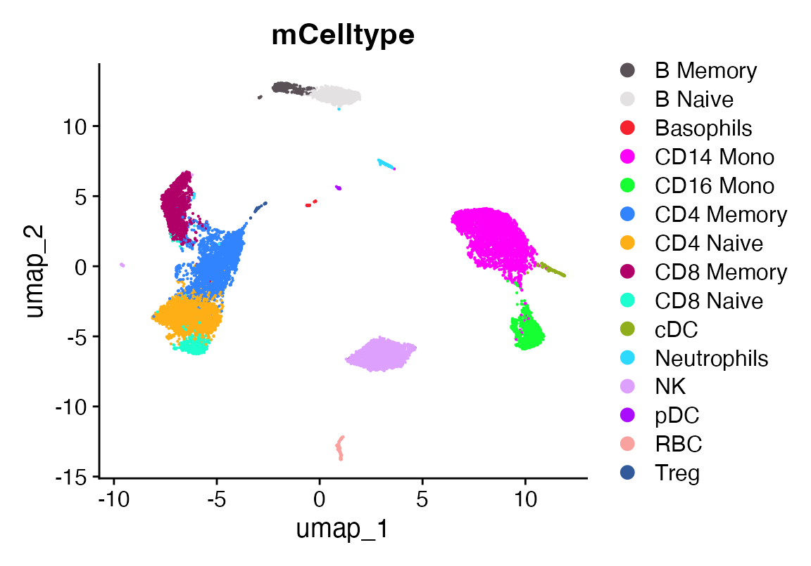

``` r

#need to fix spelling error
#seu$mCelltype[seu$mCelltype=="Jeutrophils"]<-"Neutrophils"
DimPlot_scCustom(seu, group.by = "viewmastR_pred")
```

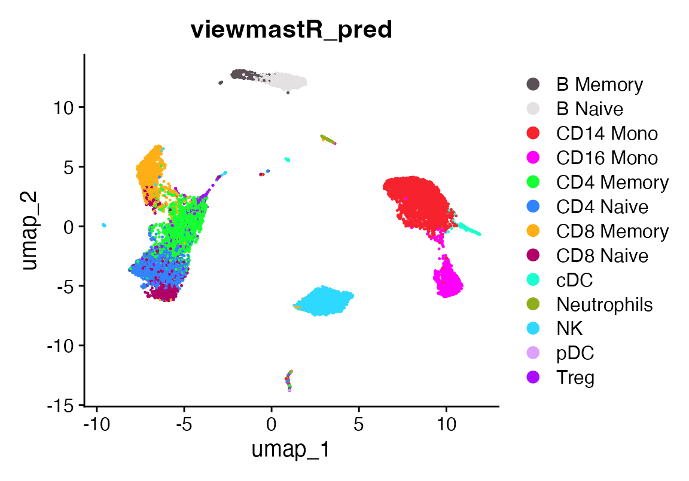

## A confusion matrix showing prediction vs ground truth

``` r

co<-as.character(pals::polychrome(length(levels(factor(c(seu$mCelltype, seu$viewmastR_pred))))))
names(co)<-levels(factor(c(seu$mCelltype, seu$viewmastR_pred)))
confusion_matrix(pred = factor(seu$viewmastR_pred), gt = factor(seu$mCelltype), cols = co)
```

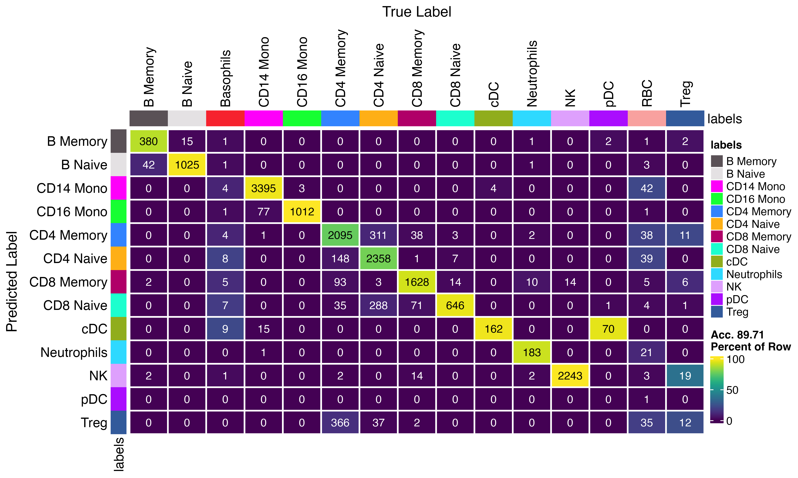

``` r

Idents(seu)<-seu$viewmastR_pred
VlnPlot_scCustom(seu, features = "FOXP3")
```

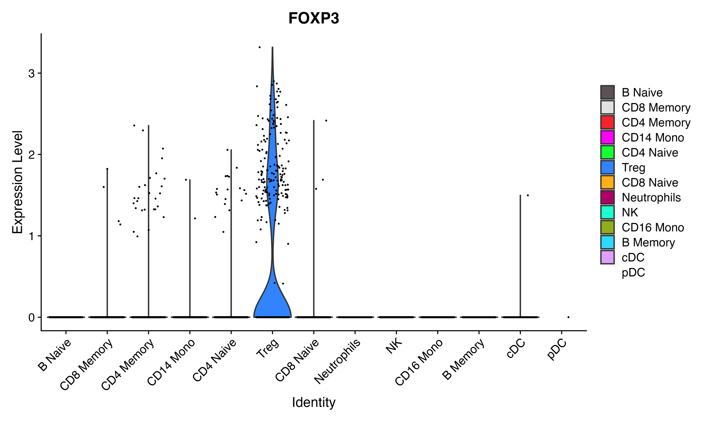

``` r

Idents(seu)<-seu$mCelltype
VlnPlot_scCustom(seu, features = "FOXP3")
```

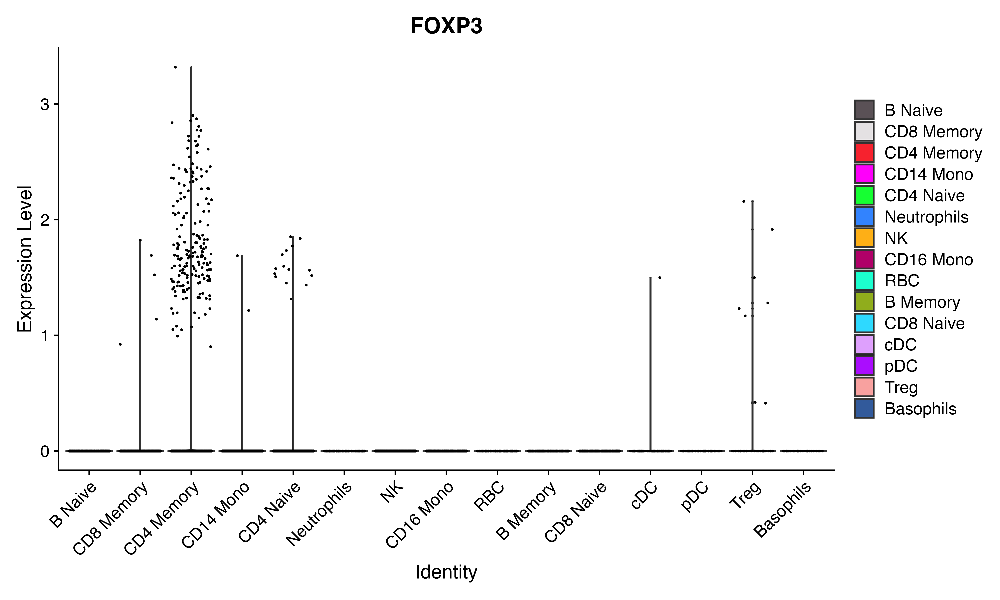

## Appendix

``` r

sessionInfo()
```

    ## R version 4.4.3 (2025-02-28)
    ## Platform: aarch64-apple-darwin20
    ## Running under: macOS Sequoia 15.7.3
    ## 
    ## Matrix products: default
    ## BLAS:   /Library/Frameworks/R.framework/Versions/4.4-arm64/Resources/lib/libRblas.0.dylib 
    ## LAPACK: /Library/Frameworks/R.framework/Versions/4.4-arm64/Resources/lib/libRlapack.dylib;  LAPACK version 3.12.0
    ## 
    ## locale:
    ## [1] en_US.UTF-8/en_US.UTF-8/en_US.UTF-8/C/en_US.UTF-8/en_US.UTF-8
    ## 
    ## time zone: America/Los_Angeles
    ## tzcode source: internal
    ## 
    ## attached base packages:
    ## [1] stats     graphics  grDevices utils     datasets  methods   base     
    ## 
    ## other attached packages:
    ## [1] future_1.69.0      magrittr_2.0.4     scCustomize_3.2.4  ggplot2_4.0.1     
    ## [5] Seurat_5.4.0       SeuratObject_5.3.0 sp_2.2-0           viewmastR_0.5.0   
    ## 
    ## loaded via a namespace (and not attached):
    ##   [1] fs_1.6.6                    matrixStats_1.5.0          
    ##   [3] spatstat.sparse_3.1-0       RcppMsgPack_0.2.4          
    ##   [5] lubridate_1.9.4             httr_1.4.7                 
    ##   [7] RColorBrewer_1.1-3          doParallel_1.0.17          
    ##   [9] tools_4.4.3                 sctransform_0.4.3          
    ##  [11] backports_1.5.0             R6_2.6.1                   
    ##  [13] lazyeval_0.2.2              uwot_0.2.4                 
    ##  [15] GetoptLong_1.0.5            withr_3.0.2                
    ##  [17] gridExtra_2.3               progressr_0.18.0           
    ##  [19] cli_3.6.5                   Biobase_2.66.0             
    ##  [21] textshaping_1.0.4           Cairo_1.7-0                
    ##  [23] spatstat.explore_3.7-0      fastDummies_1.7.5          
    ##  [25] labeling_0.4.3              prismatic_1.1.2            
    ##  [27] sass_0.4.10                 S7_0.2.1                   
    ##  [29] spatstat.data_3.1-9         proxy_0.4-29               
    ##  [31] ggridges_0.5.7              pbapply_1.7-4              
    ##  [33] pkgdown_2.2.0               systemfonts_1.3.1          
    ##  [35] foreign_0.8-90              R.utils_2.13.0             
    ##  [37] dichromat_2.0-0.1           parallelly_1.46.1          
    ##  [39] maps_3.4.2.1                mcprogress_0.1.1           
    ##  [41] pals_1.10                   rstudioapi_0.18.0          
    ##  [43] generics_0.1.4              shape_1.4.6.1              
    ##  [45] ica_1.0-3                   spatstat.random_3.4-4      
    ##  [47] dplyr_1.1.4                 Matrix_1.7-3               
    ##  [49] ggbeeswarm_0.7.3            S4Vectors_0.44.0           
    ##  [51] abind_1.4-8                 R.methodsS3_1.8.2          
    ##  [53] lifecycle_1.0.5             yaml_2.3.12                
    ##  [55] snakecase_0.11.1            SummarizedExperiment_1.36.0
    ##  [57] recipes_1.3.1               SparseArray_1.6.2          
    ##  [59] Rtsne_0.17                  paletteer_1.7.0            
    ##  [61] grid_4.4.3                  promises_1.5.0             
    ##  [63] crayon_1.5.3                miniUI_0.1.2               
    ##  [65] lattice_0.22-7              cowplot_1.2.0              
    ##  [67] mapproj_1.2.11              magick_2.9.0               
    ##  [69] pillar_1.11.1               knitr_1.51                 
    ##  [71] ComplexHeatmap_2.22.0       GenomicRanges_1.58.0       
    ##  [73] rjson_0.2.23                boot_1.3-31                
    ##  [75] future.apply_1.20.1         codetools_0.2-20           
    ##  [77] glue_1.8.0                  spatstat.univar_3.1-6      
    ##  [79] data.table_1.18.0           vctrs_0.7.1                
    ##  [81] png_0.1-8                   spam_2.11-3                
    ##  [83] Rdpack_2.6.4                gtable_0.3.6               
    ##  [85] rematch2_2.1.2              assertthat_0.2.1           
    ##  [87] cachem_1.1.0                gower_1.0.2                
    ##  [89] xfun_0.56                   rbibutils_2.3              
    ##  [91] S4Arrays_1.6.0              mime_0.13                  
    ##  [93] prodlim_2025.04.28          reformulas_0.4.0           
    ##  [95] survival_3.8-3              timeDate_4051.111          
    ##  [97] SingleCellExperiment_1.28.1 iterators_1.0.14           
    ##  [99] pbmcapply_1.5.1             hardhat_1.4.2              
    ## [101] lava_1.8.2                  fitdistrplus_1.2-6         
    ## [103] ROCR_1.0-12                 ipred_0.9-15               
    ## [105] nlme_3.1-168                RcppAnnoy_0.0.23           
    ## [107] GenomeInfoDb_1.42.3         bslib_0.9.0                
    ## [109] irlba_2.3.5.1               vipor_0.4.7                
    ## [111] KernSmooth_2.23-26          otel_0.2.0                 
    ## [113] rpart_4.1.24                colorspace_2.1-2           
    ## [115] BiocGenerics_0.52.0         Hmisc_5.2-5                
    ## [117] nnet_7.3-20                 ggrastr_1.0.2              
    ## [119] tidyselect_1.2.1            compiler_4.4.3             
    ## [121] htmlTable_2.4.3             desc_1.4.3                 
    ## [123] DelayedArray_0.32.0         plotly_4.12.0              
    ## [125] checkmate_2.3.3             scales_1.4.0               
    ## [127] lmtest_0.9-40               stringr_1.6.0              
    ## [129] digest_0.6.39               goftest_1.2-3              
    ## [131] spatstat.utils_3.2-1        minqa_1.2.8                
    ## [133] rmarkdown_2.30              XVector_0.46.0             
    ## [135] htmltools_0.5.9             pkgconfig_2.0.3            
    ## [137] base64enc_0.1-3             lme4_1.1-37                
    ## [139] sparseMatrixStats_1.18.0    MatrixGenerics_1.18.1      
    ## [141] fastmap_1.2.0               rlang_1.1.7                
    ## [143] GlobalOptions_0.1.3         htmlwidgets_1.6.4          
    ## [145] UCSC.utils_1.2.0            shiny_1.12.1               
    ## [147] DelayedMatrixStats_1.28.1   farver_2.1.2               
    ## [149] jquerylib_0.1.4             zoo_1.8-15                 
    ## [151] jsonlite_2.0.0              ModelMetrics_1.2.2.2       
    ## [153] R.oo_1.27.0                 Formula_1.2-5              
    ## [155] GenomeInfoDbData_1.2.13     dotCall64_1.2              
    ## [157] patchwork_1.3.2             Rcpp_1.1.1                 
    ## [159] reticulate_1.44.1           stringi_1.8.7              
    ## [161] pROC_1.19.0.1               zlibbioc_1.52.0            
    ## [163] MASS_7.3-65                 plyr_1.8.9                 
    ## [165] parallel_4.4.3              listenv_0.10.0             
    ## [167] ggrepel_0.9.6               forcats_1.0.1              
    ## [169] deldir_2.0-4                splines_4.4.3              
    ## [171] tensor_1.5.1                circlize_0.4.17            
    ## [173] igraph_2.2.1                spatstat.geom_3.7-0        
    ## [175] RcppHNSW_0.6.0              reshape2_1.4.5             
    ## [177] stats4_4.4.3                evaluate_1.0.5             
    ## [179] ggprism_1.0.7               nloptr_2.2.1               
    ## [181] foreach_1.5.2               httpuv_1.6.16              
    ## [183] RANN_2.6.2                  tidyr_1.3.2                
    ## [185] purrr_1.2.1                 polyclip_1.10-7            
    ## [187] clue_0.3-66                 scattermore_1.2            
    ## [189] janitor_2.2.1               xtable_1.8-4               
    ## [191] monocle3_1.3.7              e1071_1.7-17               
    ## [193] RSpectra_0.16-2             later_1.4.5                
    ## [195] viridisLite_0.4.2           class_7.3-23               
    ## [197] ragg_1.5.0                  tibble_3.3.1               
    ## [199] beeswarm_0.4.0              IRanges_2.40.1             
    ## [201] cluster_2.1.8.1             timechange_0.3.0           
    ## [203] globals_0.18.0              caret_7.0-1

``` r

getwd()
```

    ## [1] "/Users/sfurlan/develop/viewmastR/vignettes"
