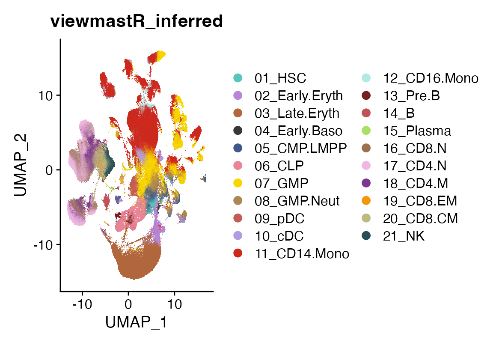
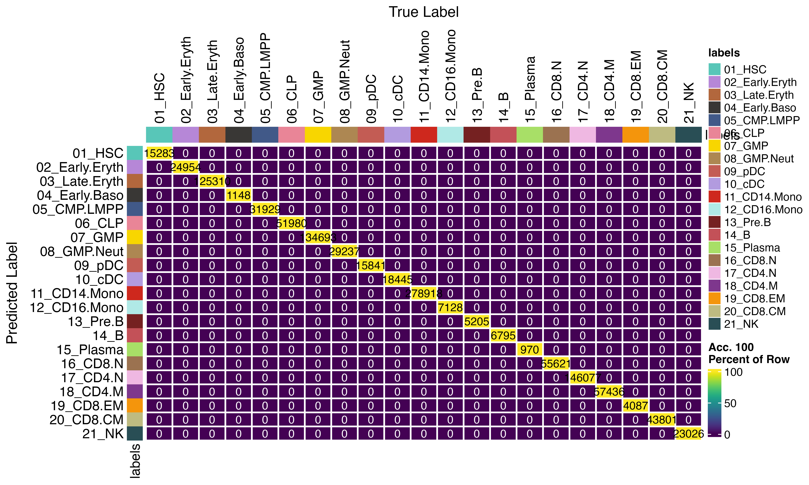

# How to use viewmastR with large query objects

## Installing Rust

First you need to have an updated Rust installation. Go to this
[site](https://www.rust-lang.org/tools/install) to learn how to install
Rust.

## Installing viewmastR

You will need to have the devtools package installed…

``` r

devtools::install_github("furlan-lab/viewmastR")
```

## Running viewmastR

``` r

suppressPackageStartupMessages({
  library(viewmastR)
  library(Seurat)
  library(ggplot2)
})

#query dataset
#seu <- readRDS(file.path(ROOT_DIR1, "240813_final_object.RDS"))
seu <- qs2::qs_read("/Users/sfurlan/Library/CloudStorage/OneDrive-SharedLibraries-FredHutchCancerCenter/Furlan_Lab_2025 - General/experiments/AML_MRD/DL2_SF/cds/260113_Filtered_Processed_vmAnnotated_scrublet.qs")
#reference dataset
seur<-readRDS(file.path(ROOT_DIR2, "230329_rnaAugmented_seurat.RDS"))
vg <- get_selected_features(seu)
vg <- vg[vg %in% rownames(seur)]
```

## Build the model and infer for small dataset (not using chunks and parallelization)

This is also covered elsewhere

``` r

results <- viewmastR(seu, seur, ref_celldata_col = "SFClassification", selected_features = vg, max_epochs = 4, train_only = T)


seu<-viewmastR_infer(seu, results[["model_dir"]], vg, labels = levels(factor(seur$SFClassification)))


DimPlot(seu, group.by = "viewmastR_inferred", cols = seur@misc$colors)
```



## Build the model and infer for large dataset (dividing the query into chunks and using parallelization)

By using chunks and workers, you can infer from the model only chunks at
a time using multiple workers in parallel.

``` r

gc()
```

    ##             used   (Mb) gc trigger    (Mb) limit (Mb)   max used    (Mb)
    ## Ncells  11296441  603.3   57654596  3079.1         NA   72068244  3848.9
    ## Vcells 772235464 5891.7 4742042616 36179.0     131072 8120631284 61955.5

``` r

system.time({
  seu <- viewmastR_infer(seu, results[["model_dir"]], 
                         query_celldata_col = "test1", vg, 
                         labels = levels(factor(seur$SFClassification)), 
                         threads = 1)
})
```

    ##    user  system elapsed 
    ## 132.740  45.308 183.008

``` r

# Parallel nd (8 threads)
system.time({
  seu <- viewmastR_infer(seu, results[["model_dir"]], 
                         query_celldata_col = "test2", vg, 
                         labels = levels(factor(seur$SFClassification)), 
                         threads = 8)
})
```

    ##    user  system elapsed 
    ## 144.396  59.958 168.579

``` r

all(seu$test1==seu$test2)
```

    ## [1] TRUE

We see no difference if parallelization is used

``` r

confusion_matrix(pred = factor(seu$test1), gt = factor(seu$test2), cols = seur@misc$colors)
```


