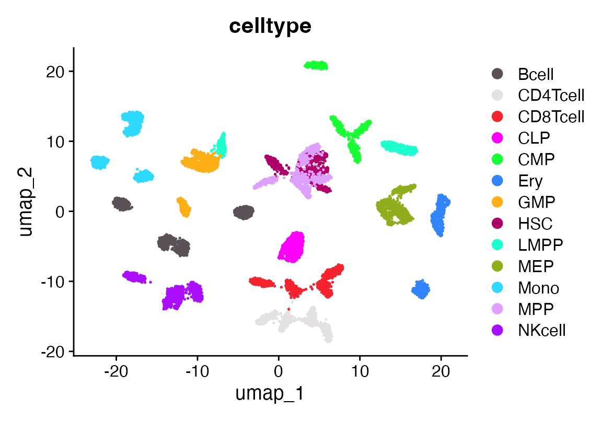
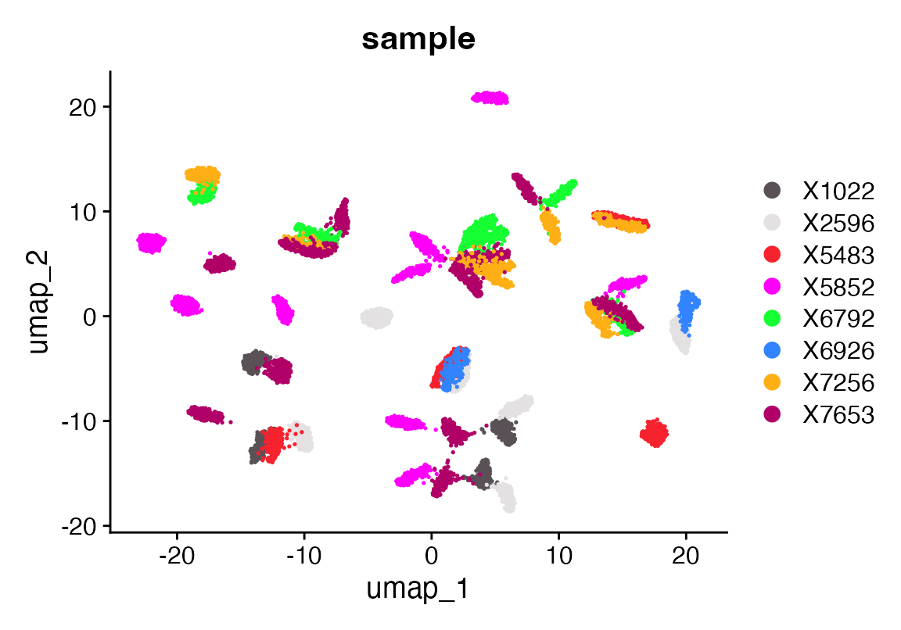
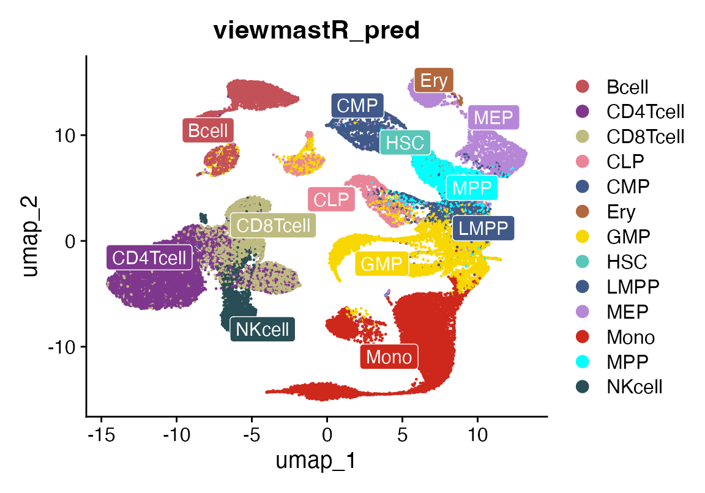
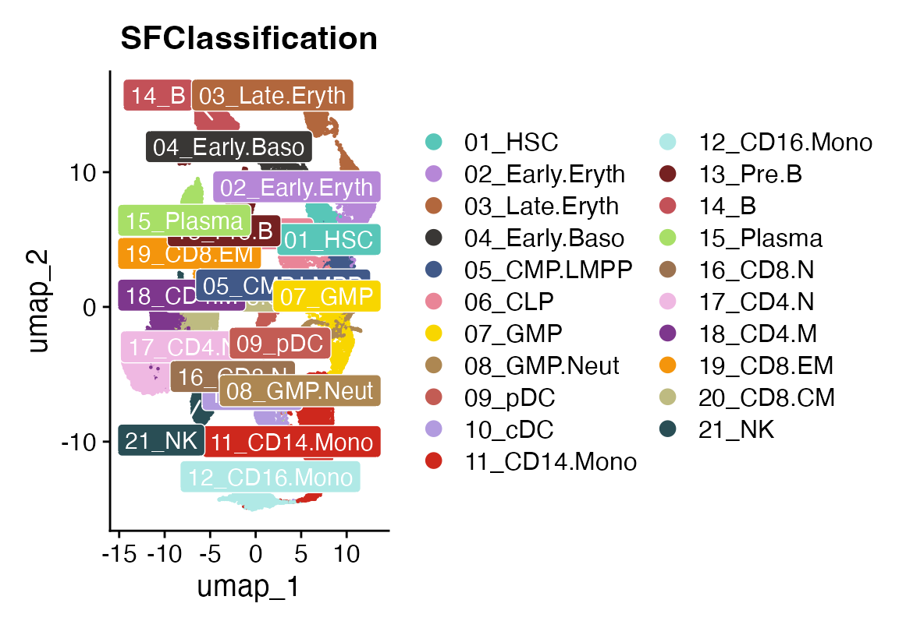
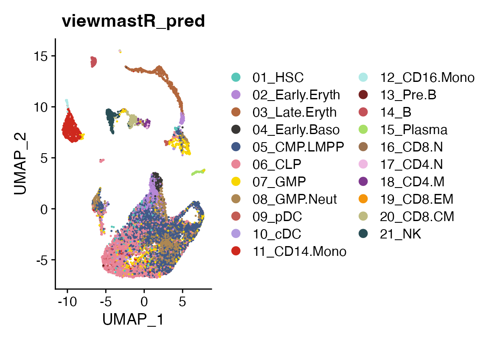
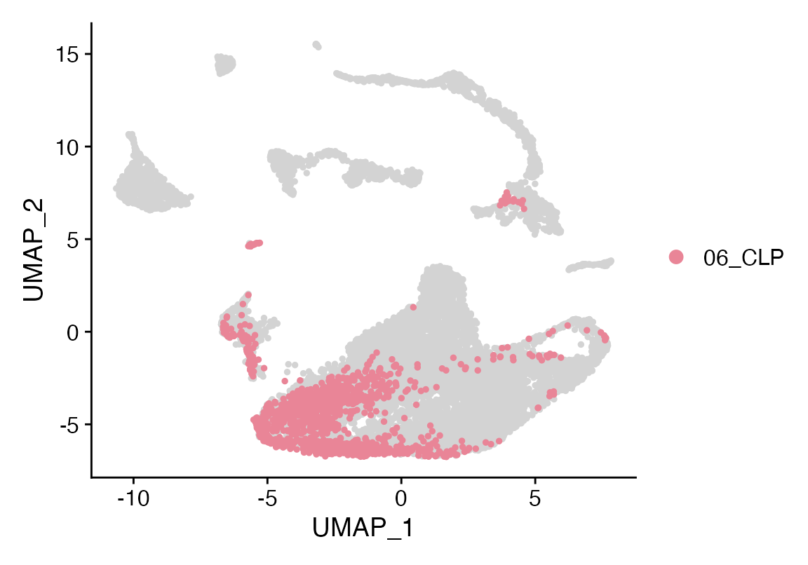
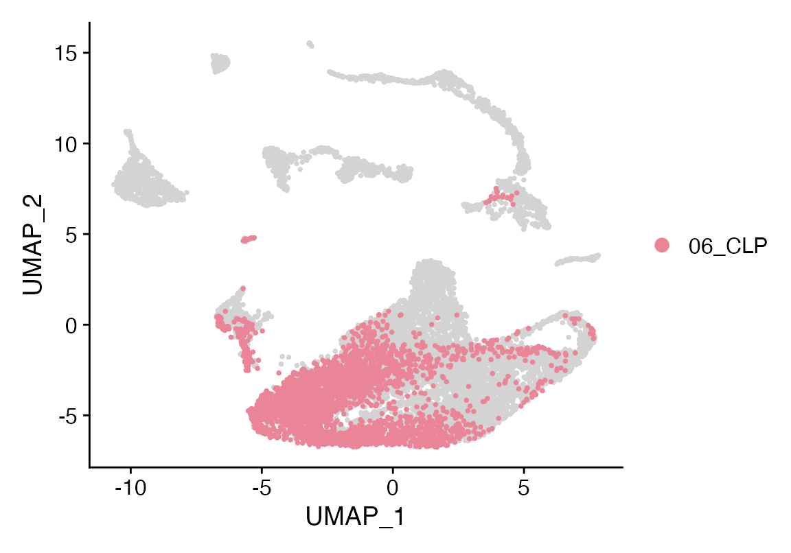
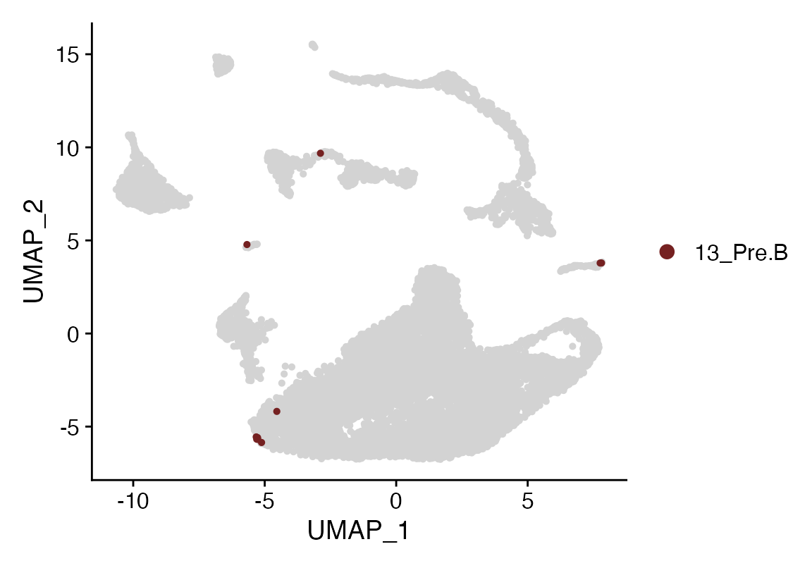
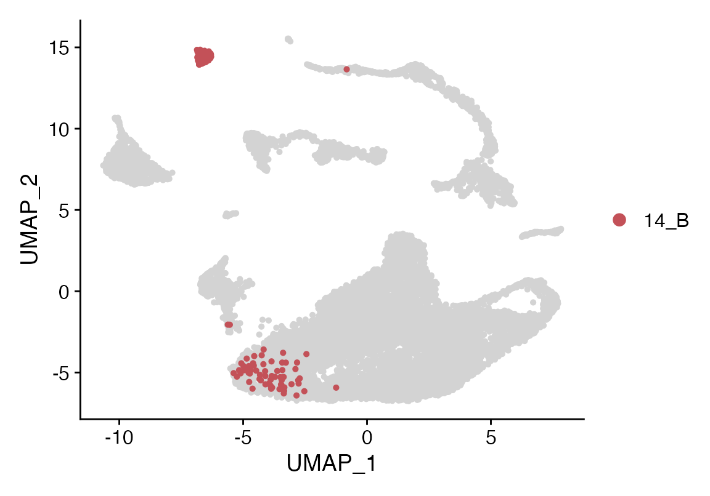
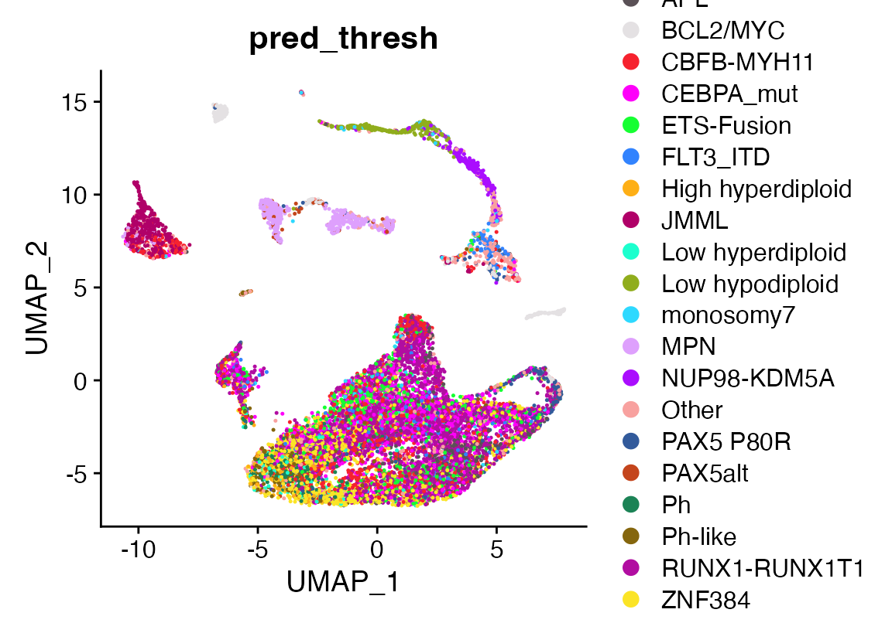

# How to use a bulk dataset as a reference for viewmastR

## Installing Rust

First you need to have an updated Rust installation. Go to this
[site](https://www.rust-lang.org/tools/install) to learn how to install
Rust.

## Installing viewmastR

You will need to have the devtools package installed…

``` r

devtools::install_github("furlan-lab/viewmastR")
```

## Load a few datasets

``` r

suppressPackageStartupMessages({
library(viewmastR)
library(Seurat)
  library(SeuratObject)
library(ggplot2)
library(scCustomize)
library(magrittr)
library(SummarizedExperiment)
})

#malignant ref (bulk)
seuMR<-readRDS(file.path(ROOT_DIR1, "240126_AML_object.RDS"))
seMR<-readRDS(file.path(ROOT_DIR1, "240126_Combined_SE_Object.RDS"))

#healthy ref (sc)
seuHR <- readRDS(file.path(ROOT_DIR3, "230329_rnaAugmented_seurat.RDS"))

#query dataset
seuP<-readRDS(file.path(ROOT_DIR2, "220831_ptdata.RDS"))
```

## Make a bulk classifier

We can then see how this classifies cells from a scRNAseq experiment.
This is first done by loading the data and creating a \[Summarized
Experiment\]
(<https://bioconductor.org/packages/release/bioc/html/SummarizedExperiment.html>).
We remove a few malignant/modified cells from the reference. The
function “splat_bulk_reference” takes a SummarizedExperiment and returns
a Seurat object made by generating pseudo-single-cell data which can
then be used as a reference for viewmastR. We invoke viewmastR. Although
it is not necessary, we can then visualize a UMAP of the
single-cellified bulk reference using a standard Seurat workflow.
Finally, we can visualize the bulk viewmastR classification result
compared to the published cell labels. While, we see fairly faithful
overlap, the bulk reference does not contain samples for all the
celltypes, so cells such as plasma cells and cDCs are called other
celltypes.

``` r

dat<-read.table(allcounts, header = T)
rownames(dat)<-dat$X_TranscriptID
dat$X_TranscriptID<-NULL
metad<-data.frame(sample = strsplit(colnames(dat), "\\.") %>% sapply("[[", 1), celltype = strsplit(colnames(dat), "\\.") %>% sapply("[[", 2))
rowd<-DataFrame(gene_short_name = rownames(dat), row.names = rownames(dat))
obj<-SummarizedExperiment::SummarizedExperiment(assays = list(counts=dat), rowData = rowd, colData = metad)


#remove samples we don't want
obj<-obj[,!grepl("^Blast", obj$celltype)] #blasts
obj<-obj[,!grepl("^rHSC", obj$celltype)] #recombinant HSCs
obj<-obj[,!grepl("^LSC", obj$celltype)] #leukemia stem cells
#obj<-obj[,obj$sample %in% c("X5852", "X5483")] #two donors

#undebug(splat_bulk_reference)
seuF<-splat_bulk_reference(seuHR, obj, N=200)

seuF<-NormalizeData(seuF)
seuF <- FindVariableFeatures(seuF,  nfeatures = 1000, assay = "RNA")
seuF <- ScaleData(seuF) %>% RunPCA(features = VariableFeatures(object = seuF), npcs = 100)
ElbowPlot(seuF, 100) 
```


``` r

seuF<- FindNeighbors(seuF, dims = 1:20)
seuF <- FindClusters(seuF, resolution = 1.1)
```

    ## Modularity Optimizer version 1.3.0 by Ludo Waltman and Nees Jan van Eck
    ## 
    ## Number of nodes: 9800
    ## Number of edges: 359225
    ## 
    ## Running Louvain algorithm...
    ## Maximum modularity in 10 random starts: 0.9509
    ## Number of communities: 34
    ## Elapsed time: 0 seconds

``` r

seuF <- RunUMAP(seuF, dims = 1:20, n.components = 2, min.dist = 0.6)
DimPlot(seuF, group.by = "celltype", cols = as.character(pals::polychrome(20)))
```



``` r

DimPlot(seuF, group.by = "sample", cols = as.character(pals::polychrome(20)))
```



``` r

seuF<-calculate_feature_dispersion(seuF)
```

    ##   |                                                                              |                                                                      |   0%  |                                                                              |======================================================================| 100%

``` r

seuF<-select_features(seuF, top_n = 10000, logmean_ul = -1, logmean_ll = -8)
vgr<-get_selected_features(seuF)
seuHR<-calculate_feature_dispersion(seuHR)
```

    ##   |                                                                              |                                                                      |   0%  |                                                                              |============                                                          |  17%  |                                                                              |=======================                                               |  33%  |                                                                              |===================================                                   |  50%  |                                                                              |===============================================                       |  67%  |                                                                              |==========================================================            |  83%  |                                                                              |======================================================================| 100%

``` r

seuHR<-select_features(seuHR, top_n = 10000, logmean_ul = -1, logmean_ll = -8)
vgq<-get_selected_features(seuHR)
vg<-intersect(vgq, vgr)

seuHR<-viewmastR::viewmastR(query_cds = seuHR, ref_cds = seuF, ref_celldata_col = "celltype", selected_features = vg)
cols<-c(seuHR@misc$colors[c(14,18,20,6,5,3,7,1,5,2,11)], "cyan", seuHR@misc$colors[c(21)])
names(cols)<-levels(factor(seuF$celltype))

DimPlot_scCustom(seuHR, group.by = "viewmastR_pred", colors_use  = cols, label = T, repel = T, label.box = T, label.color = "white")
```



``` r

DimPlot_scCustom(seuHR, group.by = "SFClassification", colors_use  = seuHR@misc$colors, label = T, repel = T, label.box = T, label.color = "white")
```



## Let’s look at a patient

This patient is post transplant with evidence of chimerism. Let’s run
viewmastR using a reference of healthy BM on the cells to see how the
cells annotate

``` r

seuP<-calculate_feature_dispersion(seuP)
```

    ##   |                                                                              |                                                                      |   0%  |                                                                              |===================================                                   |  50%  |                                                                              |======================================================================| 100%

``` r

seuP<-select_features(seuP, top_n = 10000, logmean_ul = -1, logmean_ll = -8)
vgr<-get_selected_features(seuP)
seuHR<-calculate_feature_dispersion(seuHR)
```

    ##   |                                                                              |                                                                      |   0%  |                                                                              |============                                                          |  17%  |                                                                              |=======================                                               |  33%  |                                                                              |===================================                                   |  50%  |                                                                              |===============================================                       |  67%  |                                                                              |==========================================================            |  83%  |                                                                              |======================================================================| 100%

``` r

seuHR<-select_features(seuHR, top_n = 10000, logmean_ul = -1, logmean_ll = -8)
vgq<-get_selected_features(seuHR)
vg<-intersect(vgq, vgr)
seuP<-viewmastR::viewmastR(query_cds = seuP, ref_cds = seuHR, ref_celldata_col = "SFClassification", selected_features = vg)

DimPlot_scCustom(seuP, group.by = "viewmastR_pred", colors_use = seuHR@misc$colors)
```



``` r

seuP$geno_label<-seuP$geno
seuP$geno_label[seuP$geno %in% "0"]<-"Donor"
seuP$geno_label[seuP$geno %in% "1"]<-"Recipient"
DimPlot_scCustom(seuP, group.by = "geno_label")
```



## Interesting that we see some lymphoid/B signature in this patient with a RUNX1-RUNX1T1 fusion

``` r

Idents(seuP)<-seuP$viewmastR_pred
#levels(factor(as.character(seuP$viewmastR_pred)))
Cluster_Highlight_Plot(seuP, cluster_name = "06_CLP", highlight_color = seuHR@misc$colors)
```



``` r

Cluster_Highlight_Plot(seuP, cluster_name = "13_Pre.B", highlight_color = seuHR@misc$colors)
```



``` r

Cluster_Highlight_Plot(seuP, cluster_name = "14_B", highlight_color = seuHR@misc$colors)
```



## Let’s investigate how the tumor annotates using a bulk reference of leukemia cases

First we will pare down the data into a min of 3 and a max of 20 cases
per leukemia subgroup. We will make 10 cells from each case, then use
the resulting reference to classify the patient sample. There seems to
be a Ph signature in this case even though the majority of the tumor
cells annotate correctly as RUNX1-RUNX1T1

``` r

obj<-seMR
#rowData(obj)
sttk<-names(table(obj$final_group))[table(obj$final_group)>3]
sttk<-sttk[!sttk %in% "Other"]
case_max<-20

obj<-obj[,obj$final_group %in% sttk]
ds<-names(table(obj$final_group))[table(obj$final_group)>20]
ctk<-lapply(names(table(obj$final_group)), function(type){
  cases<-which(obj$final_group %in% type)
  if (length(cases)>case_max){
    cases<-sample(cases, case_max)
  }
  cases
})
obj<-obj[,unlist(ctk)[order(unlist(ctk))]]
#table(obj$final_group)

#debug(splat_bulk_reference)
seuF<-splat_bulk_reference(seuP, obj, N=10)

seuF<-NormalizeData(seuF)
seuF <- FindVariableFeatures(seuF,  nfeatures = 1000, assay = "RNA")
seuF <- ScaleData(seuF) %>% RunPCA(features = VariableFeatures(object = seuF), npcs = 100)
ElbowPlot(seuF, 100) 
```


``` r

seuF<- FindNeighbors(seuF, dims = 1:20)
seuF <- FindClusters(seuF, resolution = 1.1)
```

    ## Modularity Optimizer version 1.3.0 by Ludo Waltman and Nees Jan van Eck
    ## 
    ## Number of nodes: 7360
    ## Number of edges: 201421
    ## 
    ## Running Louvain algorithm...
    ## Maximum modularity in 10 random starts: 0.8998
    ## Number of communities: 37
    ## Elapsed time: 0 seconds

``` r

seuF <- RunUMAP(seuF, dims = 1:20, n.components = 2, min.dist = 0.2)
seuF<-calculate_feature_dispersion(seuF)
```

    ##   |                                                                              |                                                                      |   0%  |                                                                              |======================================================================| 100%

``` r

seuF<-select_features(seuF, top_n = 10000, logmean_ul = -1, logmean_ll = -8)
vgr<-get_selected_features(seuF)
seuP<-calculate_feature_dispersion(seuP)
```

    ##   |                                                                              |                                                                      |   0%  |                                                                              |===================================                                   |  50%  |                                                                              |======================================================================| 100%

``` r

seuP<-select_features(seuP, top_n = 10000, logmean_ul = -1, logmean_ll = -8)
vgq<-get_selected_features(seuP)
vg<-intersect(vgq, vgr)

seuP<-viewmastR::viewmastR(query_cds = seuP, ref_cds = seuF, ref_celldata_col = "final_group", selected_features = vg)

thresh<-100
seuP$pred_thresh<-seuP$viewmastR_pred
seuP$pred_thresh[seuP$pred_thresh %in% names(table(seuP$viewmastR_pred))[table(seuP$viewmastR_pred)<thresh]]<-"Other"
DimPlot_scCustom(seuP, group.by = "pred_thresh")
```



## Appendix

``` r

sessionInfo()
```

    ## R version 4.4.3 (2025-02-28)
    ## Platform: aarch64-apple-darwin20
    ## Running under: macOS Sequoia 15.7.3
    ## 
    ## Matrix products: default
    ## BLAS:   /Library/Frameworks/R.framework/Versions/4.4-arm64/Resources/lib/libRblas.0.dylib 
    ## LAPACK: /Library/Frameworks/R.framework/Versions/4.4-arm64/Resources/lib/libRlapack.dylib;  LAPACK version 3.12.0
    ## 
    ## locale:
    ## [1] en_US.UTF-8/en_US.UTF-8/en_US.UTF-8/C/en_US.UTF-8/en_US.UTF-8
    ## 
    ## time zone: America/Los_Angeles
    ## tzcode source: internal
    ## 
    ## attached base packages:
    ## [1] stats4    stats     graphics  grDevices utils     datasets  methods  
    ## [8] base     
    ## 
    ## other attached packages:
    ##  [1] future_1.69.0               SummarizedExperiment_1.36.0
    ##  [3] Biobase_2.66.0              GenomicRanges_1.58.0       
    ##  [5] GenomeInfoDb_1.42.3         IRanges_2.40.1             
    ##  [7] S4Vectors_0.44.0            BiocGenerics_0.52.0        
    ##  [9] MatrixGenerics_1.18.1       matrixStats_1.5.0          
    ## [11] magrittr_2.0.4              scCustomize_3.2.4          
    ## [13] ggplot2_4.0.1               Seurat_5.4.0               
    ## [15] SeuratObject_5.3.0          sp_2.2-0                   
    ## [17] viewmastR_0.5.0            
    ## 
    ## loaded via a namespace (and not attached):
    ##   [1] fs_1.6.6                    spatstat.sparse_3.1-0      
    ##   [3] RcppMsgPack_0.2.4           lubridate_1.9.4            
    ##   [5] httr_1.4.7                  RColorBrewer_1.1-3         
    ##   [7] doParallel_1.0.17           tools_4.4.3                
    ##   [9] sctransform_0.4.3           backports_1.5.0            
    ##  [11] R6_2.6.1                    lazyeval_0.2.2             
    ##  [13] uwot_0.2.4                  GetoptLong_1.0.5           
    ##  [15] withr_3.0.2                 gridExtra_2.3              
    ##  [17] progressr_0.18.0            cli_3.6.5                  
    ##  [19] textshaping_1.0.4           spatstat.explore_3.7-0     
    ##  [21] fastDummies_1.7.5           prismatic_1.1.2            
    ##  [23] labeling_0.4.3              sass_0.4.10                
    ##  [25] S7_0.2.1                    spatstat.data_3.1-9        
    ##  [27] ggridges_0.5.7              pbapply_1.7-4              
    ##  [29] pkgdown_2.2.0               systemfonts_1.3.1          
    ##  [31] foreign_0.8-90              R.utils_2.13.0             
    ##  [33] dichromat_2.0-0.1           parallelly_1.46.1          
    ##  [35] maps_3.4.2.1                mcprogress_0.1.1           
    ##  [37] pals_1.10                   rstudioapi_0.18.0          
    ##  [39] generics_0.1.4              shape_1.4.6.1              
    ##  [41] ica_1.0-3                   spatstat.random_3.4-4      
    ##  [43] dplyr_1.1.4                 Matrix_1.7-3               
    ##  [45] ggbeeswarm_0.7.3            abind_1.4-8                
    ##  [47] R.methodsS3_1.8.2           lifecycle_1.0.5            
    ##  [49] yaml_2.3.12                 snakecase_0.11.1           
    ##  [51] recipes_1.3.1               SparseArray_1.6.2          
    ##  [53] Rtsne_0.17                  paletteer_1.7.0            
    ##  [55] grid_4.4.3                  promises_1.5.0             
    ##  [57] crayon_1.5.3                miniUI_0.1.2               
    ##  [59] lattice_0.22-7              cowplot_1.2.0              
    ##  [61] mapproj_1.2.11              pillar_1.11.1              
    ##  [63] knitr_1.51                  ComplexHeatmap_2.22.0      
    ##  [65] rjson_0.2.23                boot_1.3-31                
    ##  [67] future.apply_1.20.1         codetools_0.2-20           
    ##  [69] glue_1.8.0                  spatstat.univar_3.1-6      
    ##  [71] data.table_1.18.0           vctrs_0.7.1                
    ##  [73] png_0.1-8                   spam_2.11-3                
    ##  [75] Rdpack_2.6.4                gtable_0.3.6               
    ##  [77] rematch2_2.1.2              assertthat_0.2.1           
    ##  [79] cachem_1.1.0                gower_1.0.2                
    ##  [81] xfun_0.56                   rbibutils_2.3              
    ##  [83] S4Arrays_1.6.0              mime_0.13                  
    ##  [85] prodlim_2025.04.28          reformulas_0.4.0           
    ##  [87] survival_3.8-3              timeDate_4051.111          
    ##  [89] SingleCellExperiment_1.28.1 iterators_1.0.14           
    ##  [91] pbmcapply_1.5.1             hardhat_1.4.2              
    ##  [93] lava_1.8.2                  fitdistrplus_1.2-6         
    ##  [95] ROCR_1.0-12                 ipred_0.9-15               
    ##  [97] nlme_3.1-168                RcppAnnoy_0.0.23           
    ##  [99] bslib_0.9.0                 irlba_2.3.5.1              
    ## [101] vipor_0.4.7                 KernSmooth_2.23-26         
    ## [103] otel_0.2.0                  rpart_4.1.24               
    ## [105] colorspace_2.1-2            Hmisc_5.2-5                
    ## [107] nnet_7.3-20                 ggrastr_1.0.2              
    ## [109] tidyselect_1.2.1            compiler_4.4.3             
    ## [111] htmlTable_2.4.3             desc_1.4.3                 
    ## [113] DelayedArray_0.32.0         plotly_4.12.0              
    ## [115] checkmate_2.3.3             scales_1.4.0               
    ## [117] lmtest_0.9-40               stringr_1.6.0              
    ## [119] digest_0.6.39               goftest_1.2-3              
    ## [121] spatstat.utils_3.2-1        minqa_1.2.8                
    ## [123] rmarkdown_2.30              XVector_0.46.0             
    ## [125] htmltools_0.5.9             pkgconfig_2.0.3            
    ## [127] base64enc_0.1-3             lme4_1.1-37                
    ## [129] sparseMatrixStats_1.18.0    fastmap_1.2.0              
    ## [131] rlang_1.1.7                 GlobalOptions_0.1.3        
    ## [133] htmlwidgets_1.6.4           UCSC.utils_1.2.0           
    ## [135] shiny_1.12.1                DelayedMatrixStats_1.28.1  
    ## [137] farver_2.1.2                jquerylib_0.1.4            
    ## [139] zoo_1.8-15                  jsonlite_2.0.0             
    ## [141] ModelMetrics_1.2.2.2        R.oo_1.27.0                
    ## [143] Formula_1.2-5               GenomeInfoDbData_1.2.13    
    ## [145] dotCall64_1.2               patchwork_1.3.2            
    ## [147] Rcpp_1.1.1                  reticulate_1.44.1          
    ## [149] stringi_1.8.7               pROC_1.19.0.1              
    ## [151] zlibbioc_1.52.0             MASS_7.3-65                
    ## [153] plyr_1.8.9                  parallel_4.4.3             
    ## [155] listenv_0.10.0              ggrepel_0.9.6              
    ## [157] forcats_1.0.1               deldir_2.0-4               
    ## [159] splines_4.4.3               tensor_1.5.1               
    ## [161] circlize_0.4.17             igraph_2.2.1               
    ## [163] spatstat.geom_3.7-0         RcppHNSW_0.6.0             
    ## [165] reshape2_1.4.5              evaluate_1.0.5             
    ## [167] ggprism_1.0.7               nloptr_2.2.1               
    ## [169] foreach_1.5.2               httpuv_1.6.16              
    ## [171] RANN_2.6.2                  tidyr_1.3.2                
    ## [173] purrr_1.2.1                 polyclip_1.10-7            
    ## [175] clue_0.3-66                 scattermore_1.2            
    ## [177] janitor_2.2.1               xtable_1.8-4               
    ## [179] monocle3_1.3.7              RSpectra_0.16-2            
    ## [181] later_1.4.5                 viridisLite_0.4.2          
    ## [183] class_7.3-23                ragg_1.5.0                 
    ## [185] tibble_3.3.1                beeswarm_0.4.0             
    ## [187] cluster_2.1.8.1             timechange_0.3.0           
    ## [189] globals_0.18.0              caret_7.0-1

``` r

getwd()
```

    ## [1] "/Users/sfurlan/develop/viewmastR/vignettes"
