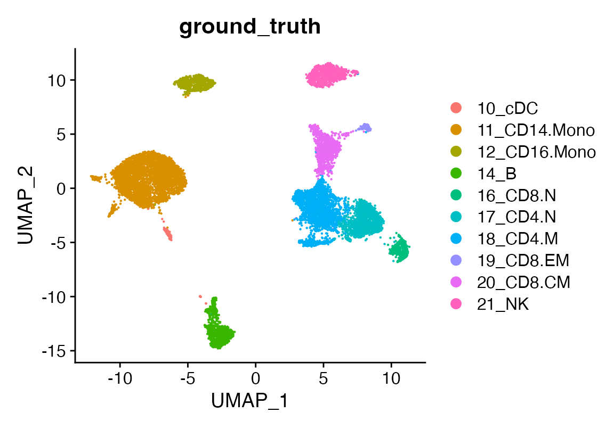

# Extra functions

First, ensure you have the `devtools` R package installed, which allows
you to install packages from GitHub. If `devtools` is installed, you can
easily install viewmastR using the following command:

``` r

devtools::install_github("furlan-lab/viewmastR")
```

``` r

# Load required packages
suppressPackageStartupMessages({
  library(viewmastR)
  library(Seurat)
  library(ggplot2)
  library(scCustomize)
  library(httpgd)
})


# Load query and reference datasets
seu <- readRDS(file.path(ROOT_DIR1, "240813_final_object.RDS"))
```

A clean Seurat object

``` r

DimPlot(seu, group.by = "ground_truth")
```



Exporting R objects to scanpy is painful… As an inefficient but
effective work around we have written code that enables you to export a
Seurat object to the same three file format output by cellranger. This
makes import into scanpy a breeze.

The command creates a folder called 3file in the directory you provide.
By default the meta data, reductions, and variable features are
exported.

Currently, only Seurat objects are supported

``` r

make3file(seu, dir = file.path(ROOT_DIR1))
list.files(file.path(ROOT_DIR1, "3file"))
```

    ## [1] "barcodes.tsv.gz"         "features.tsv.gz"        
    ## [3] "matrix.mtx.gz"           "meta.csv"               
    ## [5] "pca_reduction.tsv.gz"    "umap_reduction.tsv.gz"  
    ## [7] "variablefeatures.tsv.gz"
