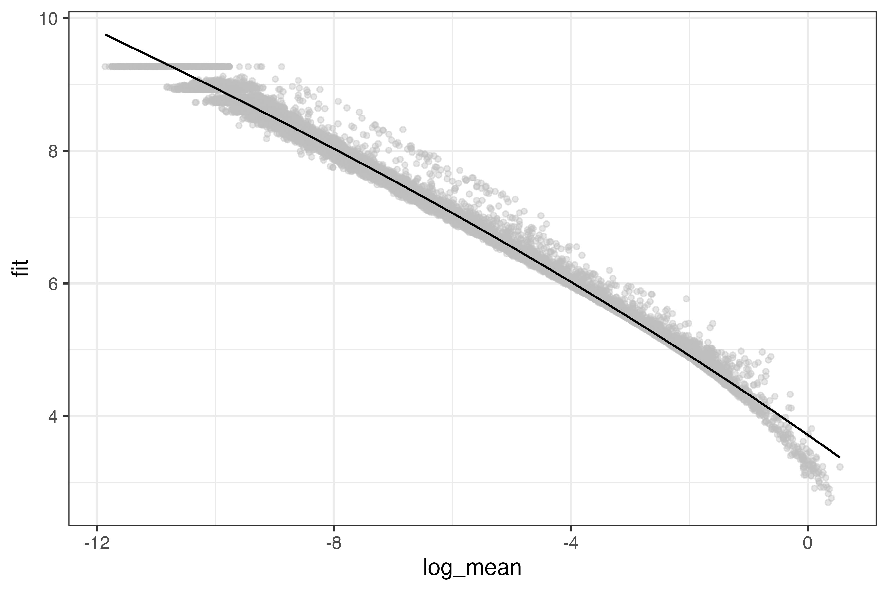
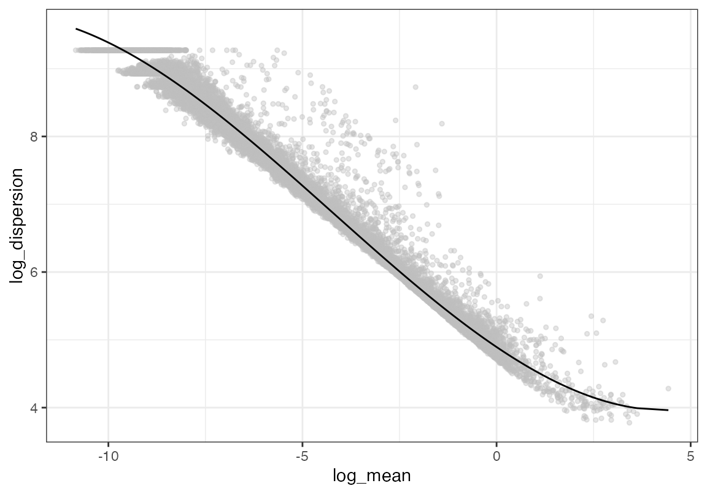
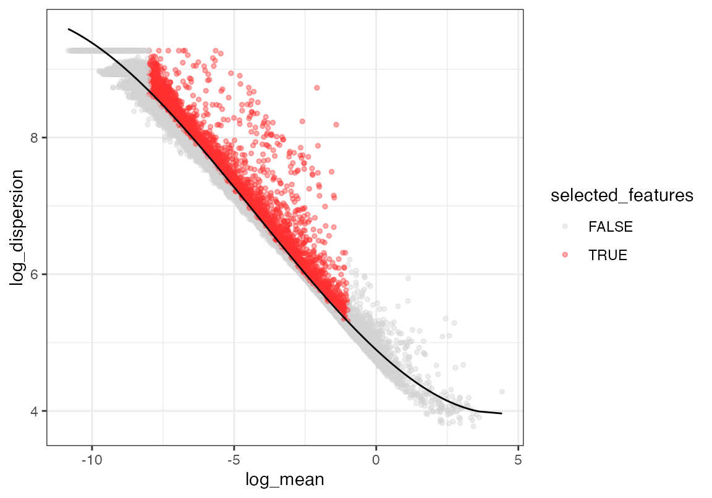
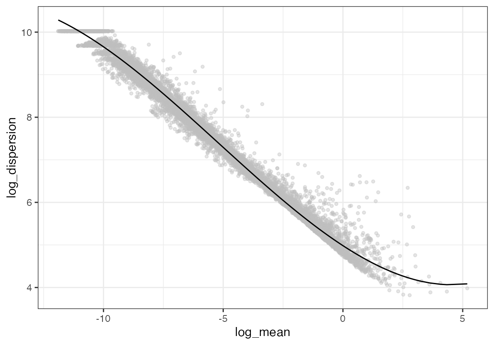
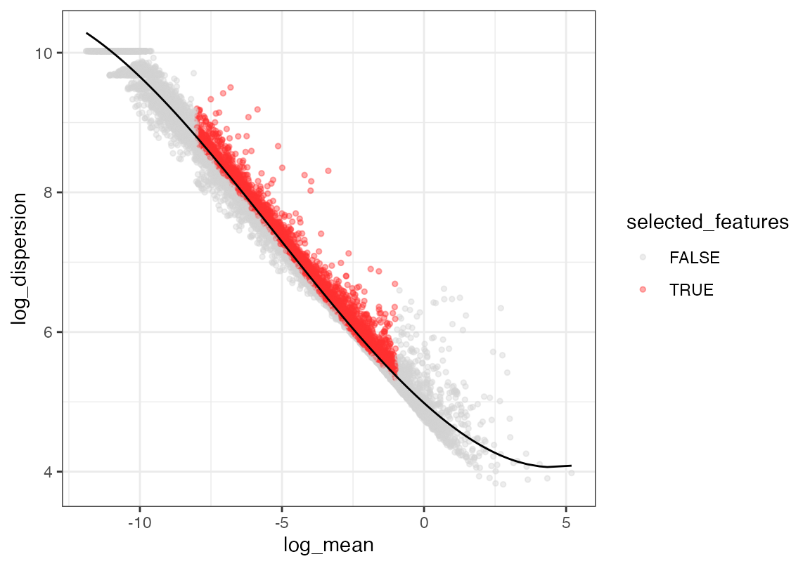
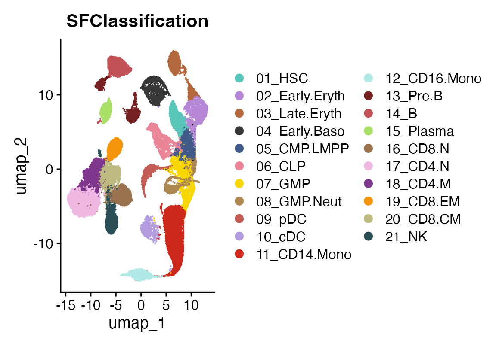
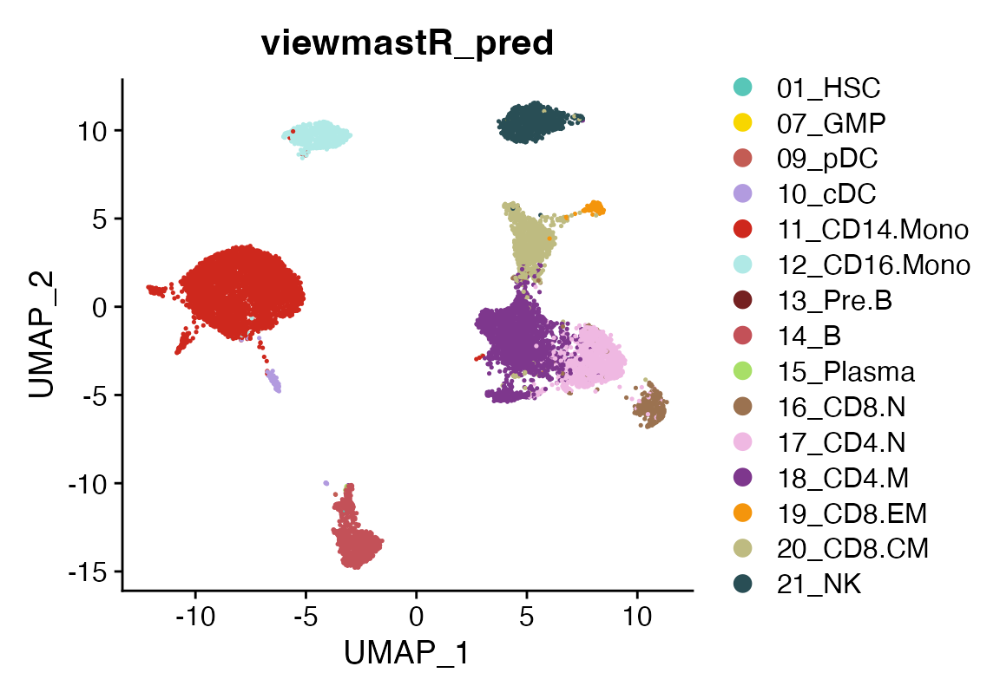
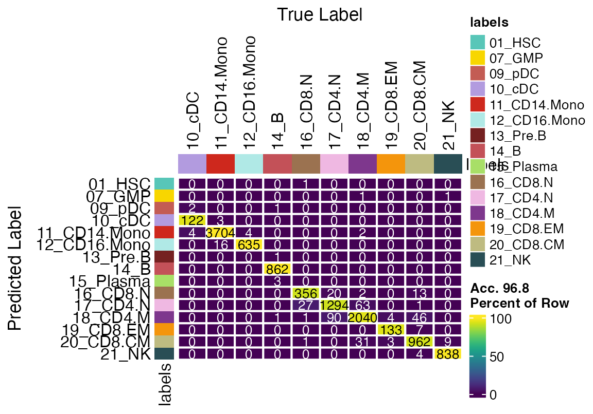
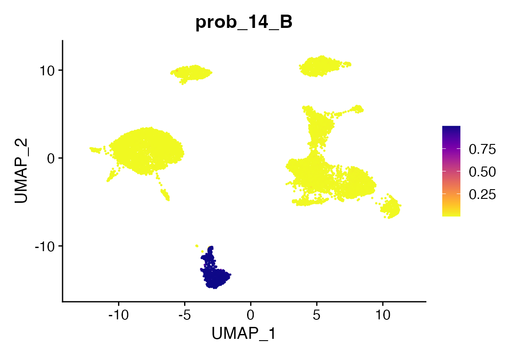
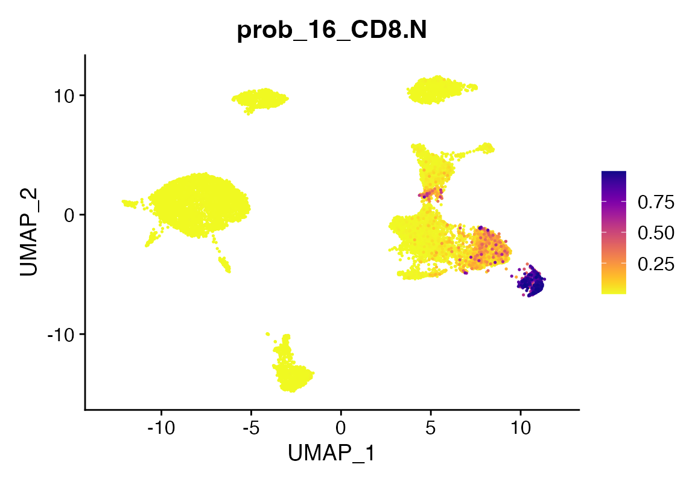

# How to use viewmastR

ViewmastR is a tool designed to predict cell type assignments in a query
dataset based on reference data. In this tutorial, you’ll learn how to
install and use viewmastR, load data, and evaluate its predictions.

## **Prerequisites**

Before we begin, ensure you have an updated Rust installation, as it’s a
core dependency. You can follow the instructions provided on the
official [Rust installation
page](https://www.rust-lang.org/tools/install).

## **Installing viewmastR**

First, ensure you have the `devtools` R package installed, which allows
you to install packages from GitHub. If `devtools` is installed, you can
easily install viewmastR using the following command:

``` r

devtools::install_github("furlan-lab/viewmastR")
```

This will fetch the latest version of viewmastR from GitHub and install
it.

## **Running viewmastR**

In this section, we’ll load two Seurat objects:  
- **Query dataset (`seu`)**: Contains the data you want to classify.  
- **Reference dataset (`seur`)**: Contains known cell type labels used
to train the model.

ViewmastR predicts the cell types of your query dataset by leveraging
the features associated with cell type labels in the reference data.

``` r

# Load required packages
suppressPackageStartupMessages({
  library(viewmastR)
  library(Seurat)
  library(ggplot2)
  library(scCustomize)
})


# Load query and reference datasets
seu <- readRDS(file.path(ROOT_DIR1, "240813_final_object.RDS"))
seur <- readRDS(file.path(ROOT_DIR2, "230329_rnaAugmented_seurat.RDS"))
```

## **Defining “Ground Truth” in the Query Dataset**

Although we don’t know the cell type labels for the query dataset a
priori, we can approximate the ground truth by using cluster-based cell
type assignments. This approximation will help us evaluate the accuracy
of viewmastR’s predictions. We can visualize the query dataset with its
ground truth labels to get an initial idea of the cell types we’re
working with.

``` r

DimPlot(seu, group.by = "ground_truth", cols = seur@misc$colors)
```



## **Finding Common Features**

The performance of viewmastR is enhanced when the features (genes) are
consistent between the query and reference datasets. We’ll now identify
and select highly variable genes in both datasets and find the common
genes to use for training the model.

``` r

# Calculate and plot gene dispersion in query dataset
seu <- calculate_feature_dispersion(seu)
```

    ##   |                                                                              |                                                                      |   0%  |                                                                              |===================================                                   |  50%  |                                                                              |======================================================================| 100%

``` r

plot_feature_dispersion(seu)
```



``` r

seu <- select_features(seu, top_n = 10000, logmean_ul = -1, logmean_ll = -8)
plot_feature_dispersion(seu)
```



``` r

vgq <- get_selected_features(seu)

# Repeat the process for the reference dataset
seur <- calculate_feature_dispersion(seur)
```

    ##   |                                                                              |                                                                      |   0%  |                                                                              |============                                                          |  17%  |                                                                              |=======================                                               |  33%  |                                                                              |===================================                                   |  50%  |                                                                              |===============================================                       |  67%  |                                                                              |==========================================================            |  83%  |                                                                              |======================================================================| 100%

``` r

plot_feature_dispersion(seur)
```



``` r

seur <- select_features(seur, top_n = 10000, logmean_ul = -1, logmean_ll = -8)
plot_feature_dispersion(seur)
```



``` r

vgr <- get_selected_features(seur)

# Find common genes
vg <- intersect(vgq, vgr)
```

## **Visualizing Reference Cell Types**

Next, we visualize the reference dataset to see the known cell type
classifications that viewmastR will use to train its model.

``` r

DimPlot(seur, group.by = "SFClassification", cols = seur@misc$colors)
```



## **Running viewmastR**

Now we run viewmastR to predict cell types in the query dataset. This
function will learn from the reference dataset’s cell type annotations
and apply its knowledge to classify the query cells.

``` r

seu <- viewmastR(seu, seur, ref_celldata_col = "SFClassification", selected_features = vg, max_epochs = 4)
```

## **Visualizing Predictions**

After running viewmastR, we can visualize the predicted cell types for
the query dataset.

``` r

DimPlot(seu, group.by = "viewmastR_pred", cols = seur@misc$colors)
```



## **Evaluating Model Accuracy with a Confusion Matrix**

We can further evaluate the accuracy of viewmastR’s predictions by
comparing them to the ground truth labels (approximated earlier) using a
confusion matrix.

``` r

confusion_matrix(pred = factor(seu$viewmastR_pred), gt = factor(seu$ground_truth), cols = seur@misc$colors)
```



## **Analyzing Training Performance**

ViewmastR can also return a detailed training history, including metrics
like training loss and validation loss over time. This helps diagnose
overfitting or underfitting during model training.

To access these metrics, you need to set the `return_type` parameter to
`"list"`. Here’s an example of how to retrieve and plot the training
data:

``` r

# Run viewmastR with return_type = "list"
output_list <- viewmastR(seu, seur, ref_celldata_col = "SFClassification", selected_features = vg, return_type = "list")

# Plot training data
plot_training_data(output_list)
```

We can now visualize how the training and validation losses change over
the epochs. If the training loss keeps decreasing while the validation
loss plateaus or increases, it may indicate overfitting.

``` r

plt <- plot_training_data(output_list)
plt
```

## **Probabilities**

Finally, we can also look at prediction probabilities using the
return_probs argument. Doing so will add meta-data columns to the object
prefixed with the string “probs\_” for each class of prediction. The
values are transformed log-odds from the model prediction transformed
using the `plogis` function in R.

``` r

seu <- viewmastR(seu, seur, ref_celldata_col = "SFClassification", selected_features = vg, max_epochs = 4, return_probs = T)
FeaturePlot_scCustom(seu, features = "prob_14_B")
```



``` r

FeaturePlot_scCustom(seu, features = "prob_16_CD8.N")
```



## **Appendix**

``` r

sessionInfo()
```

    ## R version 4.4.3 (2025-02-28)
    ## Platform: aarch64-apple-darwin20
    ## Running under: macOS Sequoia 15.7.3
    ## 
    ## Matrix products: default
    ## BLAS:   /Library/Frameworks/R.framework/Versions/4.4-arm64/Resources/lib/libRblas.0.dylib 
    ## LAPACK: /Library/Frameworks/R.framework/Versions/4.4-arm64/Resources/lib/libRlapack.dylib;  LAPACK version 3.12.0
    ## 
    ## locale:
    ## [1] en_US.UTF-8/en_US.UTF-8/en_US.UTF-8/C/en_US.UTF-8/en_US.UTF-8
    ## 
    ## time zone: America/Los_Angeles
    ## tzcode source: internal
    ## 
    ## attached base packages:
    ## [1] stats     graphics  grDevices utils     datasets  methods   base     
    ## 
    ## other attached packages:
    ## [1] scCustomize_3.2.4  ggplot2_4.0.1      Seurat_5.4.0       SeuratObject_5.3.0
    ## [5] sp_2.2-0           viewmastR_0.5.0   
    ## 
    ## loaded via a namespace (and not attached):
    ##   [1] fs_1.6.6                    matrixStats_1.5.0          
    ##   [3] spatstat.sparse_3.1-0       RcppMsgPack_0.2.4          
    ##   [5] lubridate_1.9.4             httr_1.4.7                 
    ##   [7] RColorBrewer_1.1-3          doParallel_1.0.17          
    ##   [9] tools_4.4.3                 sctransform_0.4.3          
    ##  [11] backports_1.5.0             R6_2.6.1                   
    ##  [13] lazyeval_0.2.2              uwot_0.2.4                 
    ##  [15] GetoptLong_1.0.5            withr_3.0.2                
    ##  [17] gridExtra_2.3               progressr_0.18.0           
    ##  [19] cli_3.6.5                   Biobase_2.66.0             
    ##  [21] textshaping_1.0.4           Cairo_1.7-0                
    ##  [23] spatstat.explore_3.7-0      fastDummies_1.7.5          
    ##  [25] labeling_0.4.3              sass_0.4.10                
    ##  [27] S7_0.2.1                    spatstat.data_3.1-9        
    ##  [29] proxy_0.4-29                ggridges_0.5.7             
    ##  [31] pbapply_1.7-4               pkgdown_2.2.0              
    ##  [33] systemfonts_1.3.1           foreign_0.8-90             
    ##  [35] R.utils_2.13.0              dichromat_2.0-0.1          
    ##  [37] parallelly_1.46.1           mcprogress_0.1.1           
    ##  [39] rstudioapi_0.18.0           generics_0.1.4             
    ##  [41] shape_1.4.6.1               crosstalk_1.2.2            
    ##  [43] ica_1.0-3                   spatstat.random_3.4-4      
    ##  [45] dplyr_1.1.4                 Matrix_1.7-3               
    ##  [47] ggbeeswarm_0.7.3            S4Vectors_0.44.0           
    ##  [49] abind_1.4-8                 R.methodsS3_1.8.2          
    ##  [51] lifecycle_1.0.5             yaml_2.3.12                
    ##  [53] snakecase_0.11.1            SummarizedExperiment_1.36.0
    ##  [55] recipes_1.3.1               SparseArray_1.6.2          
    ##  [57] Rtsne_0.17                  paletteer_1.7.0            
    ##  [59] grid_4.4.3                  promises_1.5.0             
    ##  [61] crayon_1.5.3                miniUI_0.1.2               
    ##  [63] lattice_0.22-7              cowplot_1.2.0              
    ##  [65] magick_2.9.0                pillar_1.11.1              
    ##  [67] knitr_1.51                  ComplexHeatmap_2.22.0      
    ##  [69] GenomicRanges_1.58.0        rjson_0.2.23               
    ##  [71] boot_1.3-31                 future.apply_1.20.1        
    ##  [73] codetools_0.2-20            glue_1.8.0                 
    ##  [75] spatstat.univar_3.1-6       data.table_1.18.0          
    ##  [77] vctrs_0.7.1                 png_0.1-8                  
    ##  [79] spam_2.11-3                 Rdpack_2.6.4               
    ##  [81] gtable_0.3.6                rematch2_2.1.2             
    ##  [83] assertthat_0.2.1            cachem_1.1.0               
    ##  [85] gower_1.0.2                 xfun_0.56                  
    ##  [87] rbibutils_2.3               S4Arrays_1.6.0             
    ##  [89] mime_0.13                   prodlim_2025.04.28         
    ##  [91] reformulas_0.4.0            survival_3.8-3             
    ##  [93] timeDate_4051.111           SingleCellExperiment_1.28.1
    ##  [95] iterators_1.0.14            pbmcapply_1.5.1            
    ##  [97] hardhat_1.4.2               lava_1.8.2                 
    ##  [99] fitdistrplus_1.2-6          ROCR_1.0-12                
    ## [101] ipred_0.9-15                nlme_3.1-168               
    ## [103] RcppAnnoy_0.0.23            GenomeInfoDb_1.42.3        
    ## [105] bslib_0.9.0                 irlba_2.3.5.1              
    ## [107] vipor_0.4.7                 KernSmooth_2.23-26         
    ## [109] otel_0.2.0                  rpart_4.1.24               
    ## [111] colorspace_2.1-2            BiocGenerics_0.52.0        
    ## [113] Hmisc_5.2-5                 nnet_7.3-20                
    ## [115] ggrastr_1.0.2               tidyselect_1.2.1           
    ## [117] compiler_4.4.3              htmlTable_2.4.3            
    ## [119] desc_1.4.3                  DelayedArray_0.32.0        
    ## [121] plotly_4.12.0               checkmate_2.3.3            
    ## [123] scales_1.4.0                lmtest_0.9-40              
    ## [125] stringr_1.6.0               digest_0.6.39              
    ## [127] goftest_1.2-3               spatstat.utils_3.2-1       
    ## [129] minqa_1.2.8                 rmarkdown_2.30             
    ## [131] XVector_0.46.0              htmltools_0.5.9            
    ## [133] pkgconfig_2.0.3             base64enc_0.1-3            
    ## [135] lme4_1.1-37                 sparseMatrixStats_1.18.0   
    ## [137] MatrixGenerics_1.18.1       fastmap_1.2.0              
    ## [139] rlang_1.1.7                 GlobalOptions_0.1.3        
    ## [141] htmlwidgets_1.6.4           UCSC.utils_1.2.0           
    ## [143] shiny_1.12.1                DelayedMatrixStats_1.28.1  
    ## [145] farver_2.1.2                jquerylib_0.1.4            
    ## [147] zoo_1.8-15                  jsonlite_2.0.0             
    ## [149] ModelMetrics_1.2.2.2        R.oo_1.27.0                
    ## [151] magrittr_2.0.4              Formula_1.2-5              
    ## [153] GenomeInfoDbData_1.2.13     dotCall64_1.2              
    ## [155] patchwork_1.3.2             Rcpp_1.1.1                 
    ## [157] reticulate_1.44.1           stringi_1.8.7              
    ## [159] pROC_1.19.0.1               zlibbioc_1.52.0            
    ## [161] MASS_7.3-65                 plyr_1.8.9                 
    ## [163] parallel_4.4.3              listenv_0.10.0             
    ## [165] ggrepel_0.9.6               forcats_1.0.1              
    ## [167] deldir_2.0-4                splines_4.4.3              
    ## [169] tensor_1.5.1                circlize_0.4.17            
    ## [171] igraph_2.2.1                spatstat.geom_3.7-0        
    ## [173] RcppHNSW_0.6.0              reshape2_1.4.5             
    ## [175] stats4_4.4.3                evaluate_1.0.5             
    ## [177] ggprism_1.0.7               nloptr_2.2.1               
    ## [179] foreach_1.5.2               httpuv_1.6.16              
    ## [181] RANN_2.6.2                  tidyr_1.3.2                
    ## [183] purrr_1.2.1                 polyclip_1.10-7            
    ## [185] future_1.69.0               clue_0.3-66                
    ## [187] scattermore_1.2             janitor_2.2.1              
    ## [189] xtable_1.8-4                monocle3_1.3.7             
    ## [191] e1071_1.7-17                RSpectra_0.16-2            
    ## [193] later_1.4.5                 viridisLite_0.4.2          
    ## [195] class_7.3-23                ragg_1.5.0                 
    ## [197] tibble_3.3.1                beeswarm_0.4.0             
    ## [199] IRanges_2.40.1              cluster_2.1.8.1            
    ## [201] timechange_0.3.0            globals_0.18.0             
    ## [203] caret_7.0-1

``` r

getwd()
```

    ## [1] "/Users/sfurlan/develop/viewmastR/vignettes"
