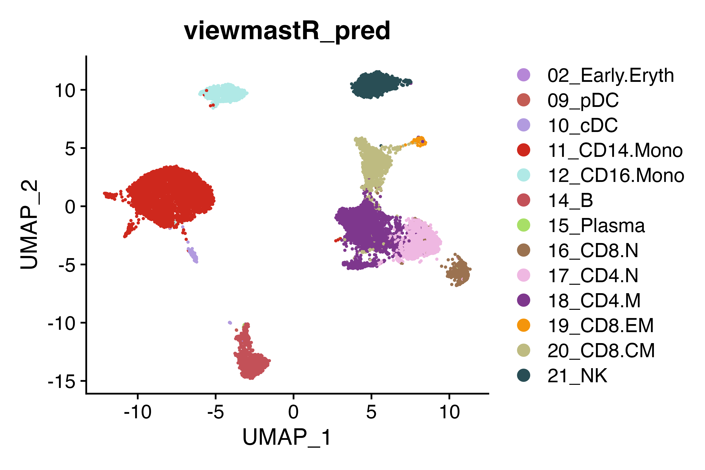
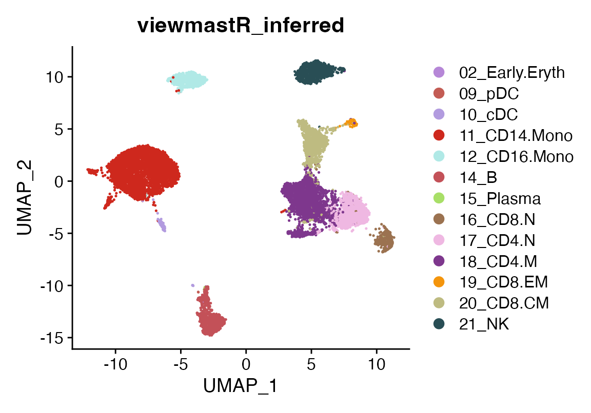
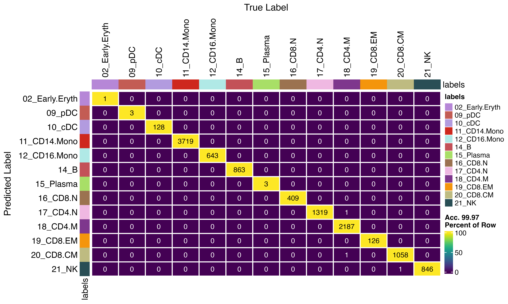

# How to use viewmastR with saved models

## Installing Rust

First you need to have an updated Rust installation. Go to this
[site](https://www.rust-lang.org/tools/install) to learn how to install
Rust.

## Installing viewmastR

You will need to have the devtools package installed…

``` r

devtools::install_github("furlan-lab/viewmastR")
```

## Running viewmastR

``` r

suppressPackageStartupMessages({
library(viewmastR)
library(Seurat)
library(ggplot2)
})

#query dataset
seu <- readRDS(file.path(ROOT_DIR1, "240813_final_object.RDS"))
#reference dataset
seur<-readRDS(file.path(ROOT_DIR2, "230329_rnaAugmented_seurat.RDS"))
vg <- get_selected_features(seu)
```

## Now you run viewmastR

The model path is specified using the ‘dir’ argument

``` r

seu<-viewmastR(seu, seur, ref_celldata_col = "SFClassification", selected_features = vg, model_dir =  "/tmp/sc_local", max_epochs = 3, return_probs = T)
```

## A look at the predictions

``` r

DimPlot(seu, group.by = "viewmastR_pred", cols = seur@misc$colors)
```



## Run inference

We can use the function viewmastR_infer to run inference a saved model.
We will need to pass the same vector of variable features we used to
initially create the model. We can use query_celldata_col to specify the
name of the metadata column in the returned object. An optional vector
of labels can be provided. Additionally, instead of returning the input
object with predictions added, you may instead return the probabilities
using the return_probs argument.

``` r

seu_infer <- viewmastR_infer(seu, model_dir = "/tmp/sc_local", vg, 
                              labels = levels(factor(seur$SFClassification)),
                              return_probs = TRUE)

DimPlot(seu_infer, group.by = "viewmastR_inferred", cols = seur@misc$colors)
```



## Comparing training-time vs saved-model inference

When comparing predictions from viewmastR (training with simultaneous
query inference) to viewmastR_infer (inference using a saved model), you
may observe a small number of cells (~0.05%) with different
classifications. These differences arise from minor numerical variations
between the two computation paths.

Importantly, the disagreements occur exclusively for cells at
classification boundaries—cases where the model assigns similar
probabilities to multiple cell types. As shown below, the disagreeing
cells typically have two or more competing classes with probabilities
within a few percentage points of each other, indicating genuine
ambiguity where either classification is reasonable.

``` r

confusion_matrix(pred = factor(seu_infer$viewmastR_inferred), gt = factor(seu$viewmastR_pred), cols = seur@misc$colors)
```



``` r

disagree_idx <- which(seu$viewmastR_pred != seu_infer$viewmastR_inferred)
# Show what changed
disagree_df <- data.frame(
  cell = colnames(seu)[disagree_idx],
  viewmastR_pred = seu$viewmastR_pred[disagree_idx],
  viewmastR_inferred = seu_infer$viewmastR_inferred[disagree_idx]
)
print(disagree_df)
```

    ##                                  cell viewmastR_pred viewmastR_inferred
    ## ACACCCTCAATGTTGC-1 ACACCCTCAATGTTGC-1      20_CD8.CM              21_NK
    ## CACACCTTCATAACCG-1 CACACCTTCATAACCG-1       18_CD4.M           17_CD4.N
    ## CCACTACTCAGGTTCA-1 CCACTACTCAGGTTCA-1       18_CD4.M          20_CD8.CM

``` r

prob_cols <- colnames(seu@meta.data)[grep("prob", colnames(seu@meta.data))]


# For disagreeing cells, compare probabilities
if (length(disagree_idx) > 0) {
  probs_direct <- as.matrix(seu@meta.data[disagree_idx, prob_cols, drop = FALSE])
  probs_inferred <- as.matrix(seu_infer@meta.data[disagree_idx, prob_cols, drop = FALSE])
  
  # Calculate difference
  prob_diff <- probs_direct - probs_inferred
  
  # Show summary of absolute differences
  cat("\nAbsolute probability differences (disagreeing cells):\n")
  print(summary(as.vector(abs(prob_diff))))
  
  # For each disagreeing cell, show the two predictions and their probs
  disagree_df <- data.frame(
    cell = colnames(seu)[disagree_idx],
    pred_direct = seu$viewmastR_pred[disagree_idx],
    pred_inferred = seu_infer$viewmastR_inferred[disagree_idx],
    prob_direct = apply(probs_direct, 1, max),
    prob_inferred = apply(probs_inferred, 1, max),
    max_prob_diff = apply(abs(prob_diff), 1, max)
  )
  print(disagree_df)
  
  # Show the actual probabilities for the two competing classes
  for (i in seq_len(nrow(disagree_df))) {
    cell_idx <- disagree_idx[i]
    class_direct <- as.character(disagree_df$pred_direct[i])
    class_inferred <- as.character(disagree_df$pred_inferred[i])
    
    col_direct <- paste0("prob_", class_direct)
    col_inferred <- paste0("prob_", class_inferred)
    
    cat(sprintf("\nCell %s:\n", disagree_df$cell[i]))
    cat(sprintf("  Direct:   %s = %.6f, %s = %.6f\n", 
                class_direct, seu@meta.data[cell_idx, col_direct],
                class_inferred, seu@meta.data[cell_idx, col_inferred]))
    cat(sprintf("  Inferred: %s = %.6f, %s = %.6f\n", 
                class_direct, seu_infer@meta.data[cell_idx, col_direct],
                class_inferred, seu_infer@meta.data[cell_idx, col_inferred]))
  }
}
```

    ## 
    ## Absolute probability differences (disagreeing cells):
    ##      Min.   1st Qu.    Median      Mean   3rd Qu.      Max. 
    ## 1.432e-05 1.608e-04 3.702e-04 4.156e-03 1.118e-03 6.158e-02 
    ##                                  cell pred_direct pred_inferred prob_direct
    ## ACACCCTCAATGTTGC-1 ACACCCTCAATGTTGC-1   20_CD8.CM         21_NK   0.4726100
    ## CACACCTTCATAACCG-1 CACACCTTCATAACCG-1    18_CD4.M      17_CD4.N   0.5030500
    ## CCACTACTCAGGTTCA-1 CCACTACTCAGGTTCA-1    18_CD4.M     20_CD8.CM   0.4590019
    ##                    prob_inferred max_prob_diff
    ## ACACCCTCAATGTTGC-1     0.4631131    0.02817046
    ## CACACCTTCATAACCG-1     0.4688376    0.06158412
    ## CCACTACTCAGGTTCA-1     0.4358490    0.02434344
    ## 
    ## Cell ACACCCTCAATGTTGC-1:
    ##   Direct:   20_CD8.CM = 0.472610, 21_NK = 0.467282
    ##   Inferred: 20_CD8.CM = 0.444440, 21_NK = 0.463113
    ## 
    ## Cell CACACCTTCATAACCG-1:
    ##   Direct:   18_CD4.M = 0.503050, 17_CD4.N = 0.460623
    ##   Inferred: 18_CD4.M = 0.441466, 17_CD4.N = 0.468838
    ## 
    ## Cell CCACTACTCAGGTTCA-1:
    ##   Direct:   18_CD4.M = 0.459002, 20_CD8.CM = 0.448491
    ##   Inferred: 18_CD4.M = 0.434658, 20_CD8.CM = 0.435849

## Appendix

``` r

sessionInfo()
```

    ## R version 4.4.3 (2025-02-28)
    ## Platform: aarch64-apple-darwin20
    ## Running under: macOS Sequoia 15.7.3
    ## 
    ## Matrix products: default
    ## BLAS:   /Library/Frameworks/R.framework/Versions/4.4-arm64/Resources/lib/libRblas.0.dylib 
    ## LAPACK: /Library/Frameworks/R.framework/Versions/4.4-arm64/Resources/lib/libRlapack.dylib;  LAPACK version 3.12.0
    ## 
    ## locale:
    ## [1] en_US.UTF-8/en_US.UTF-8/en_US.UTF-8/C/en_US.UTF-8/en_US.UTF-8
    ## 
    ## time zone: America/Los_Angeles
    ## tzcode source: internal
    ## 
    ## attached base packages:
    ## [1] stats     graphics  grDevices utils     datasets  methods   base     
    ## 
    ## other attached packages:
    ## [1] ggplot2_4.0.1      Seurat_5.4.0       SeuratObject_5.3.0 sp_2.2-0          
    ## [5] viewmastR_0.5.0   
    ## 
    ## loaded via a namespace (and not attached):
    ##   [1] fs_1.6.6                    matrixStats_1.5.0          
    ##   [3] spatstat.sparse_3.1-0       RcppMsgPack_0.2.4          
    ##   [5] lubridate_1.9.4             httr_1.4.7                 
    ##   [7] RColorBrewer_1.1-3          doParallel_1.0.17          
    ##   [9] tools_4.4.3                 sctransform_0.4.3          
    ##  [11] backports_1.5.0             R6_2.6.1                   
    ##  [13] lazyeval_0.2.2              uwot_0.2.4                 
    ##  [15] GetoptLong_1.0.5            withr_3.0.2                
    ##  [17] gridExtra_2.3               scCustomize_3.2.4          
    ##  [19] progressr_0.18.0            cli_3.6.5                  
    ##  [21] Biobase_2.66.0              textshaping_1.0.4          
    ##  [23] Cairo_1.7-0                 spatstat.explore_3.7-0     
    ##  [25] fastDummies_1.7.5           labeling_0.4.3             
    ##  [27] sass_0.4.10                 S7_0.2.1                   
    ##  [29] spatstat.data_3.1-9         proxy_0.4-29               
    ##  [31] ggridges_0.5.7              pbapply_1.7-4              
    ##  [33] pkgdown_2.2.0               systemfonts_1.3.1          
    ##  [35] foreign_0.8-90              R.utils_2.13.0             
    ##  [37] dichromat_2.0-0.1           parallelly_1.46.1          
    ##  [39] mcprogress_0.1.1            rstudioapi_0.18.0          
    ##  [41] generics_0.1.4              shape_1.4.6.1              
    ##  [43] ica_1.0-3                   spatstat.random_3.4-4      
    ##  [45] dplyr_1.1.4                 Matrix_1.7-3               
    ##  [47] ggbeeswarm_0.7.3            S4Vectors_0.44.0           
    ##  [49] abind_1.4-8                 R.methodsS3_1.8.2          
    ##  [51] lifecycle_1.0.5             yaml_2.3.12                
    ##  [53] snakecase_0.11.1            SummarizedExperiment_1.36.0
    ##  [55] recipes_1.3.1               SparseArray_1.6.2          
    ##  [57] Rtsne_0.17                  paletteer_1.7.0            
    ##  [59] grid_4.4.3                  promises_1.5.0             
    ##  [61] crayon_1.5.3                miniUI_0.1.2               
    ##  [63] lattice_0.22-7              cowplot_1.2.0              
    ##  [65] magick_2.9.0                pillar_1.11.1              
    ##  [67] knitr_1.51                  ComplexHeatmap_2.22.0      
    ##  [69] GenomicRanges_1.58.0        rjson_0.2.23               
    ##  [71] boot_1.3-31                 future.apply_1.20.1        
    ##  [73] codetools_0.2-20            glue_1.8.0                 
    ##  [75] spatstat.univar_3.1-6       data.table_1.18.0          
    ##  [77] vctrs_0.7.1                 png_0.1-8                  
    ##  [79] spam_2.11-3                 Rdpack_2.6.4               
    ##  [81] gtable_0.3.6                rematch2_2.1.2             
    ##  [83] assertthat_0.2.1            cachem_1.1.0               
    ##  [85] gower_1.0.2                 xfun_0.56                  
    ##  [87] rbibutils_2.3               S4Arrays_1.6.0             
    ##  [89] mime_0.13                   prodlim_2025.04.28         
    ##  [91] reformulas_0.4.0            survival_3.8-3             
    ##  [93] timeDate_4051.111           SingleCellExperiment_1.28.1
    ##  [95] iterators_1.0.14            pbmcapply_1.5.1            
    ##  [97] hardhat_1.4.2               lava_1.8.2                 
    ##  [99] fitdistrplus_1.2-6          ROCR_1.0-12                
    ## [101] ipred_0.9-15                nlme_3.1-168               
    ## [103] RcppAnnoy_0.0.23            GenomeInfoDb_1.42.3        
    ## [105] bslib_0.9.0                 irlba_2.3.5.1              
    ## [107] vipor_0.4.7                 KernSmooth_2.23-26         
    ## [109] otel_0.2.0                  rpart_4.1.24               
    ## [111] colorspace_2.1-2            BiocGenerics_0.52.0        
    ## [113] Hmisc_5.2-5                 nnet_7.3-20                
    ## [115] ggrastr_1.0.2               tidyselect_1.2.1           
    ## [117] compiler_4.4.3              htmlTable_2.4.3            
    ## [119] desc_1.4.3                  DelayedArray_0.32.0        
    ## [121] plotly_4.12.0               checkmate_2.3.3            
    ## [123] scales_1.4.0                lmtest_0.9-40              
    ## [125] stringr_1.6.0               digest_0.6.39              
    ## [127] goftest_1.2-3               spatstat.utils_3.2-1       
    ## [129] minqa_1.2.8                 rmarkdown_2.30             
    ## [131] XVector_0.46.0              htmltools_0.5.9            
    ## [133] pkgconfig_2.0.3             base64enc_0.1-3            
    ## [135] lme4_1.1-37                 sparseMatrixStats_1.18.0   
    ## [137] MatrixGenerics_1.18.1       fastmap_1.2.0              
    ## [139] rlang_1.1.7                 GlobalOptions_0.1.3        
    ## [141] htmlwidgets_1.6.4           UCSC.utils_1.2.0           
    ## [143] shiny_1.12.1                DelayedMatrixStats_1.28.1  
    ## [145] farver_2.1.2                jquerylib_0.1.4            
    ## [147] zoo_1.8-15                  jsonlite_2.0.0             
    ## [149] ModelMetrics_1.2.2.2        R.oo_1.27.0                
    ## [151] magrittr_2.0.4              Formula_1.2-5              
    ## [153] GenomeInfoDbData_1.2.13     dotCall64_1.2              
    ## [155] patchwork_1.3.2             Rcpp_1.1.1                 
    ## [157] reticulate_1.44.1           stringi_1.8.7              
    ## [159] pROC_1.19.0.1               zlibbioc_1.52.0            
    ## [161] MASS_7.3-65                 plyr_1.8.9                 
    ## [163] parallel_4.4.3              listenv_0.10.0             
    ## [165] ggrepel_0.9.6               forcats_1.0.1              
    ## [167] deldir_2.0-4                splines_4.4.3              
    ## [169] tensor_1.5.1                circlize_0.4.17            
    ## [171] igraph_2.2.1                spatstat.geom_3.7-0        
    ## [173] RcppHNSW_0.6.0              reshape2_1.4.5             
    ## [175] stats4_4.4.3                evaluate_1.0.5             
    ## [177] ggprism_1.0.7               nloptr_2.2.1               
    ## [179] foreach_1.5.2               httpuv_1.6.16              
    ## [181] RANN_2.6.2                  tidyr_1.3.2                
    ## [183] purrr_1.2.1                 polyclip_1.10-7            
    ## [185] future_1.69.0               clue_0.3-66                
    ## [187] scattermore_1.2             janitor_2.2.1              
    ## [189] xtable_1.8-4                monocle3_1.3.7             
    ## [191] e1071_1.7-17                RSpectra_0.16-2            
    ## [193] later_1.4.5                 viridisLite_0.4.2          
    ## [195] class_7.3-23                ragg_1.5.0                 
    ## [197] tibble_3.3.1                beeswarm_0.4.0             
    ## [199] IRanges_2.40.1              cluster_2.1.8.1            
    ## [201] timechange_0.3.0            globals_0.18.0             
    ## [203] caret_7.0-1

``` r

getwd()
```

    ## [1] "/Users/sfurlan/develop/viewmastR/vignettes"
