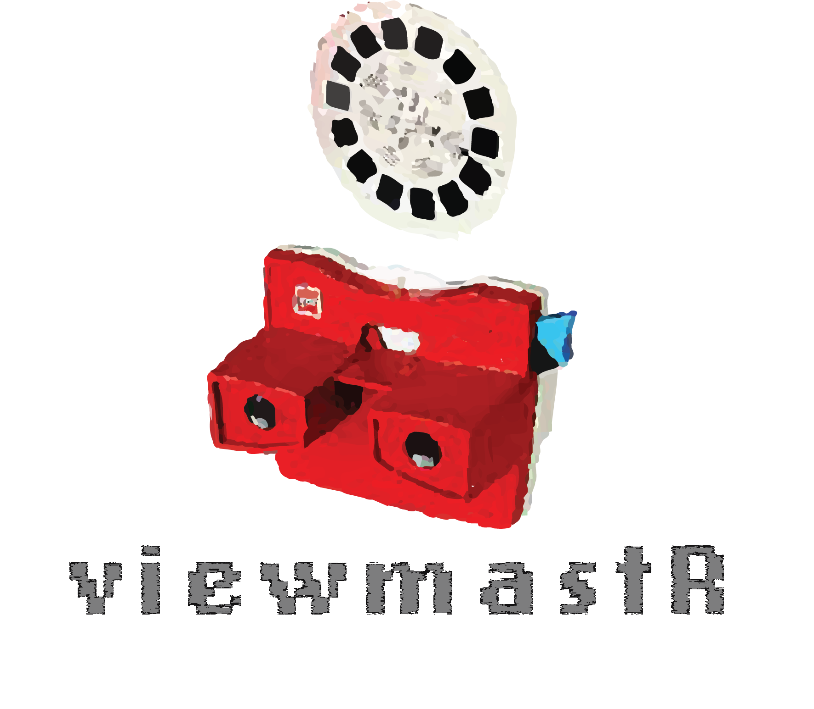
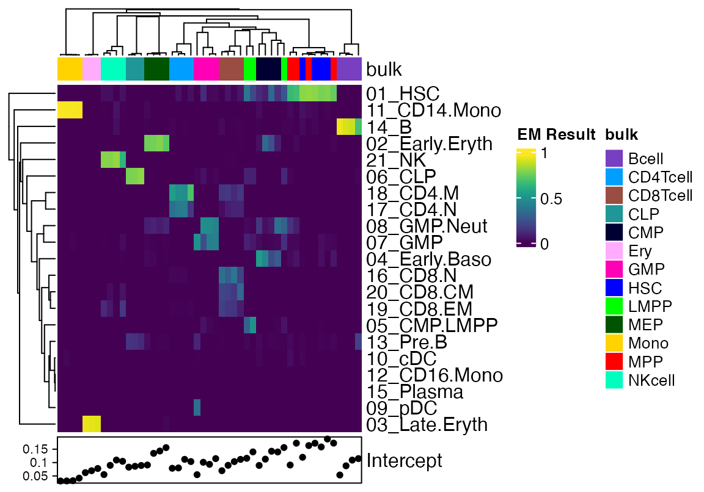
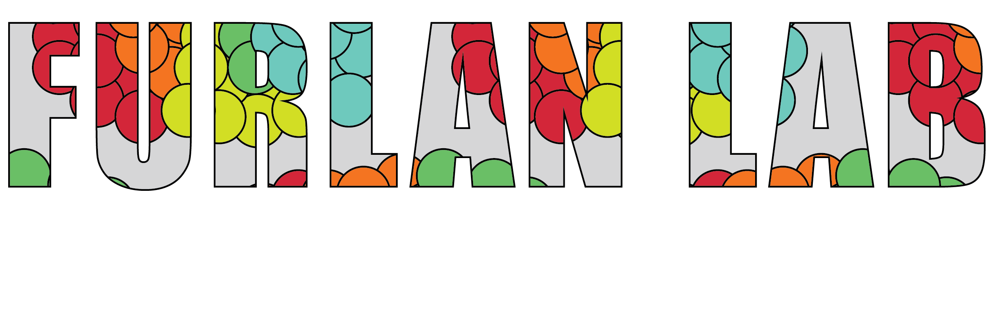

------------------------------------------------------------------------



------------------------------------------------------------------------

[](https://www.repostatus.org/#active)
[](https://lifecycle.r-lib.org/articles/stages.html)

viewmastR is a **[R](https://cran.r-project.org/)** framework for
genomic cell type classification using the
**[Burn](https://github.com/tracel-ai/burn)** machine learning library
and its modules. viewmastR is a very flexible and customizable platform
for labelling cell types in your data

The main features of viewmastR are:

- Use a blazingly fast machine learning approach to cell classification
  according to a reference dataset
- Augment data for rare cell types
- Classify single cell profiles according to a reference of bulk data

Additional features include:

- Classification of single-cell data using bulk reference datasets
- Super efficient bulk RNAseq deconvolution with intercept value



## Installation

First you need to have an updated Rust installation. Go to this
[site](https://www.rust-lang.org/tools/install) to learn how to install
Rust.

To install development version of viewmastR:

``` r

remotes::install_github("furlan-lab/viewmastR")
```

## How to start

We have a few vignettes for

- [`vignette("HowTo")`](https://furlan-lab.github.io/viewmastR/articles/HowTo.md)
  to explore the basics of the package.
- [`vignette("Augment")`](https://furlan-lab.github.io/viewmastR/articles/Augment.md)
  to explore data augmentation
- `vignette("BulkClassify")` to see how to use a bulk dataset to
  classify single-cell profiles
- [`vignette("Deconvolute")`](https://furlan-lab.github.io/viewmastR/articles/Deconvolute.md)
  to see how to deconvolute a bulk dataset using single-cell profiles

## License

viewmastR has a dependency on Burn, an open source Rust machine learning
library. viewmastR itself is written with an MIT license.

## Acknowledgements

Written by Scott Furlan.



------------------------------------------------------------------------
